---
tags:
  - init
  - runtime
  - persistent-objects
---

# Инициализация и Runtime (Initialization)

Этот документ описывает текущую стартовую цепочку игры и разделение ответственности между `obj_Init` и `obj_globalManager`.

## Обзор (Overview)

В `Undefinedtale-888` используется централизованная система инициализации. Стартовая логика собирается в `obj_Init`, а runtime-поддержка после запуска передаётся `obj_globalManager`.

### Диаграмма запуска (Startup Flow)

```mermaid
sequenceDiagram
    participant Runner as Game Runner
    participant R_Init as rm_init
    participant O_Init as obj_Init
    participant O_Music as obj_music_ctrl
    participant O_Global as obj_globalManager
    participant R_Menu as rm_roomMenu
    participant O_Menu as obj_menu

    Runner->>R_Init: Start Game
    R_Init->>O_Init: Create Event

    rect rgb(20, 20, 40)
        note right of O_Init: Phase 1: Init
        O_Init->>O_Init: scr_constants() — направления, стейты меню
        O_Init->>O_Init: Безопасные дефолты аудио и окна
        O_Init->>O_Init: scr_game_state_load() + scr_loadSettings()
        O_Init->>O_Init: scr_applySettings() — разрешение, громкость
        O_Init->>O_Init: scr_buildInputMap() + UI sfx map
        O_Init->>O_Init: DEV-LOAD / спавн / сейвы кэш
        O_Init->>O_Init: scr_music_init() + cutscene_register_chatterbox_functions()
        O_Init->>O_Music: instance_create(obj_music_ctrl)
        O_Init->>O_Init: global.show_notification definition
        O_Init->>O_Init: Инвентарь + статы + диалог face-система
        O_Init->>O_Init: First-launch window sizing (если нужно)
        O_Init->>O_Global: instance_create(obj_globalManager)
    end

    O_Init->>R_Menu: room_goto(rm_roomMenu)
    R_Menu->>O_Menu: Create Event
    O_Menu->>O_Music: global.play_music(music_menu)
```



## Порядок запуска

| # | Шаг | Код / Функция | Описание |
|---|-----|---------------|----------|
| 1 | **`rm_init`** | — | Первая комната. Нужна только для стартовой загрузки. |
| 2 | **`obj_Init` защита от дублей | `global.__init_done` | Если инициализация уже была — выходим, дубликаты уничтожаем. |
| 3 | **Константы** | `scr_constants()` | `global.DIR` (RIGHT/LEFT/UP/DOWN), `global.SETTINGS_STATE` (ROOT/CATEGORY/REBIND/CONFIRM_RESET). |
| 4 | **Безопасные дефолты аудио** | — | `global.__current_master_volume`, `__music_volume`, `__sfx_volume` = 1.0. Защита от падения при раннем доступе. |
| 5 | **Безопасные дефолты окна** | — | `global.__window_prev_*`, `__window_borderless_active`. Нужны до `scr_applySettings()`. |
| 6 | **Состояние и настройки** | `scr_game_state_load()` + `scr_loadSettings()` | Читаем `game_state.dat` и `player_settings.dat`. |
| 7 | **Применение настроек** | `scr_applySettings()` | Разрешение, полноэкранный режим, громкость. Если в настройках включён debug — активируем `global.debug`. |
| 8 | **Ввод и UI звуки** | `scr_buildInputMap()` | Карта управления из настроек. Таблица UI-sfx (`global.ui_sfx_map`). Input repeater state. |
| 9 | **DEV-LOAD и спавн** | — | `global.__dev_spawn*`, `global.obj_player = noone`, `__next_spawn_*`, `__transition_safety_frames`. |
| 10 | **Кэш метаданных сейвов** | — | `global.__save_slot_metadata_cache` — читаем «шапку» каждого `saveN.txt` (x, y, facing, room) один раз, чтобы убрать фриз при первом открытии меню выбора. |
| 11 | **Музыкальная система** | `scr_music_init()` | Инициализация всех music-глобалов и функций: `global.play_music()`, `global.play_music_fade()`, `global.play_music_immediate()`, ducking, layered mode и др. Создаётся `obj_music_ctrl` (persistent), который каждый кадр обновляет фейды. |
| 12 | **Chatterbox интеграция** | `cutscene_register_chatterbox_functions()` | Регистрирует все `c_*` команды катсцен как Yarn-функции (`c_walk`, `c_dialogue`, `c_fadein` и т.д.). |
| 13 | **Уведомления** | — | Определяется `global.show_notification(text)` — пишет в `obj_globalManager.notification_*`. |
| 14 | **Первый запуск** | — | Если `player_settings.dat` не существовал — подгоняем размер окна под экран и центрируем. |
| 15 | **Инвентарь и статы** | `script_items()` | `global.item[0..7]`, `global.item_count`, `global.SetArmor/Weapon`, `global.stat_hp/maxhp/atk/def/lv/gold/xp`, `global.name`. |
| 16 | **Диалог face-система** | — | `global.current_actor`, `global.current_emote`, `global.is_talking`, `global.talk_index`, `global.current_sprite`, `global.current_voice`, `global.voice_speed`. |
| 17 | **Создание менеджеров** | — | `obj_globalManager` создаётся в конце init-фазы. |
| 18 | **Переход в меню** | `room_goto(rm_roomMenu)` | Если мы в `rm_init`. |
| 19 | **Музыка меню** | `global.play_music(music_menu)` | Запускается из `obj_menu.Create`, а не из `obj_Init`. |

## Роли объектов

### `obj_Init`
- **Тип**: Singleton, Persistent.
- **Ответственность**: холодный старт и подготовка **всех** глобальных данных до начала обычного gameplay.
- **Жизненный цикл**: создаётся в `rm_init`, защищён от дублей (`global.__init_done`) и нужен для корректного старта даже при нестандартном запуске.
- **Что инициализирует**: константы, аудио-дефолты, окно-дефолты, `game_state`, `player_settings`, input map, UI sfx, DEV-LOAD переменные, кэш сейвов, музыкальную систему, Chatterbox-функции катсцен, уведомления, инвентарь, статы, диалог face-систему.

### `obj_globalManager`
- **Тип**: Singleton, Persistent.
- **Ответственность**: runtime-поддержка **после** завершения init-фазы.
- **Основные задачи**:
  - Следить за сменой комнат (`current_room` + `scr_global_on_room_change`).
  - Обрабатывать debug-хоткеи (F1–F12) и быстрый сейв (F7).
  - Управлять уведомлениями (`notification_active`, `notification_text`, `notification_timer`).
  - DEV-LOAD спаун игрока (`scr_global_handle_dev_spawn`).
  - Runtime катсцен: tweens, emotes, shakes, spins, jumps, fade.
  - Сброс флага `global.settings_closing`.
  - Переключение полноэкранного режима (Q).
  - Таймер безопасности после перехода (`scr_global_transition_safety`).
  - Вызов внутриигрового меню (`scr_callMenuInit`).

!!! note "Музыка не здесь"
    Музыкальные фейды управляются отдельным объектом `obj_music_ctrl` (создаётся из `obj_Init`). `obj_globalManager` НЕ содержит music-глобалов.

## Fallback (Страховка)

В `GlobalRoomCreationCode.gml` (выполняется в **каждой** комнате) есть fallback-логика на случай запуска не через стандартную цепочку `rm_init -> obj_Init -> rm_roomMenu`:

```gml title="GlobalRoomCreationCode.gml"
if (!instance_exists(obj_Init)) {
    instance_create_depth(0, 0, -10000, obj_Init);
}
if (!instance_exists(obj_globalManager)) {
    instance_create_depth(0, 0, -10000, obj_globalManager);
}
```

Если игра стартовала сразу с комнаты или уровня, fallback принудительно создаёт `obj_Init`, чтобы глобальные системы успели инициализироваться. Защита `global.__init_done` внутри `obj_Init.Create` предотвращает двойной запуск.

---

## См. также

- [Глобальное состояние](global-state.md)
- [Объекты системы](objects.md)
- [Комнаты](rooms.md)
- [Система музыки](../systems/music.md) — `scr_music_init()`, `global.play_music()`