# Инициализация и Runtime (Initialization)

Этот документ описывает процесс запуска игры и архитектуру глобальных систем.

## Обзор (Overview)

В `Undefinedtale-888` используется централизованная система инициализации. Вместо разрозненных скриптов запуска, вся логика собрана в объекте `obj_Init`.

### Диаграмма Запуска (Startup Flow)

```mermaid
sequenceDiagram
    participant Runner as Game Runner
    participant R_Init as rm_init
    participant O_Init as obj_Init
    participant O_Global as obj_globalManager
    participant R_Menu as rm_roomMenu
    participant O_Menu as obj_menu

    Runner->>R_Init: Start Game
    R_Init->>O_Init: Create Event
    
    rect rgb(20, 20, 40)
        note right of O_Init: Phase 1: Core Systems
        O_Init->>O_Init: Load Constants
        O_Init->>O_Init: Load game_state.dat
        O_Init->>O_Init: Load player_settings.dat
        O_Init->>O_Init: Build Input Map
    end

    rect rgb(40, 20, 20)
        note right of O_Init: Phase 2: Managers
        O_Init->>O_Global: Create (Persistent)
        O_Init->>O_Init: Init Audio System
        O_Init->>O_Init: Build Room Cache
    end

    O_Init->>R_Menu: room_goto(rm_roomMenu)
    R_Menu->>O_Menu: Create Event
    O_Menu->>O_Global: Start Menu Music
```

## Порядок запуска

1.  **`rm_init`**: Первая комната. Пустая, служит только для загрузки.
2.  **`obj_Init`**: Создается автоматически.
    *   `persistent = true`: Но уничтожает свои копии, если они появляются.
    *   **Settings**: Читает файл настроек. Если его нет — создает дефолтный.
    *   **Window**: Если первый запуск, подстраивает размер окна под экран.
    *   **Managers**: Создает `obj_globalManager`.
3.  **Переход**: Сразу после инициализации перекидывает в `rm_roomMenu`.

## Роли объектов

### `obj_Init`
*   **Тип**: Singleton, Persistent.
*   **Ответственность**: "Холодный" старт. Подготовка данных, которые нужны до начала игры.
*   **Жизненный цикл**: Создается в начале, живет вечно (но логика только в Create).

### `obj_globalManager`
*   **Тип**: Singleton, Persistent.
*   **Ответственность**: Runtime-поддержка.
    *   Следит за сменой комнат (`Step`).
    *   Обрабатывает Debug-хоткеи.
    *   Рисует глобальные уведомления (`Draw GUI`).
    *   Управляет плавным переходом музыки.

## Fallback (Страховка)
В `GlobalRoomCreationCode.gml` есть код, который проверяет: "А не запустили ли мы игру сразу с уровня, минуя меню?". Если да, он принудительно создает `obj_Init`, чтобы игра не упала с ошибкой.

