# Инициализация и Runtime (Initialization)

Этот документ описывает текущую стартовую цепочку игры и разделение ответственности между `obj_Init` и `obj_globalManager`.

## Обзор (Overview)

В `Undefinedtale-888` используется централизованная система инициализации. Стартовая логика собирается в `obj_Init`, а runtime-поддержка после запуска передаётся `obj_globalManager`.

### Диаграмма запуска (Startup Flow)

```mermaid
sequenceDiagram
    participant Runner as Game Runner
    participant R_Init as rm_init
    participant O_Init as obj_Init
    participant O_Global as obj_globalManager
    participant R_Menu as rm_roomMenu
    participant O_Menu as obj_menu

    Runner->>R_Init: Start Game
    R_Init->>O_Init: Create Event

    rect rgb(20, 20, 40)
        note right of O_Init: Phase 1: Init
        O_Init->>O_Init: Load constants
        O_Init->>O_Init: Load game_state.dat
        O_Init->>O_Init: Load player_settings.dat
        O_Init->>O_Init: Build input map
        O_Init->>O_Global: Create persistent runtime manager
    end

    O_Init->>R_Menu: room_goto(rm_roomMenu)
    R_Menu->>O_Menu: Create Event
    O_Menu->>O_Global: Start menu music
```

## Порядок запуска

1. **`rm_init`**: первая комната. Она нужна только для стартовой загрузки.
2. **`obj_Init`**: создаётся в `rm_init` и выполняет холодный старт.
   - загружает константы и базовые глобальные структуры
   - читает `game_state.dat`
   - читает `player_settings.dat`
   - собирает `global.input_map`
   - создаёт `obj_globalManager` как отдельный persistent runtime-объект
3. **Переход в меню**: после инициализации игра переходит в `rm_roomMenu`.
4. **Музыка меню**: стартует уже в `rm_roomMenu`, после создания меню и связанного setup.

## Роли объектов

### `obj_Init`
- **Тип**: Singleton, Persistent.
- **Ответственность**: холодный старт и подготовка глобальных данных до начала обычного gameplay.
- **Жизненный цикл**: создаётся в `rm_init`, защищён от дублей и нужен для корректного старта даже при нестандартном запуске.

### `obj_globalManager`
- **Тип**: Singleton, Persistent.
- **Ответственность**: runtime-поддержка после завершения init-фазы.
- **Основные задачи**:
  - следить за сменой комнат
  - держать глобальные runtime-состояния
  - управлять уведомлениями и debug-функциями
  - поддерживать системы, которые должны жить между комнатами

## Fallback (Страховка)

В `GlobalRoomCreationCode.gml` есть fallback-логика на случай запуска не через стандартную цепочку `rm_init -> obj_Init -> rm_roomMenu`. Если игра стартовала сразу с комнаты или уровня, fallback принудительно создаёт `obj_Init`, чтобы глобальные системы успели инициализироваться.