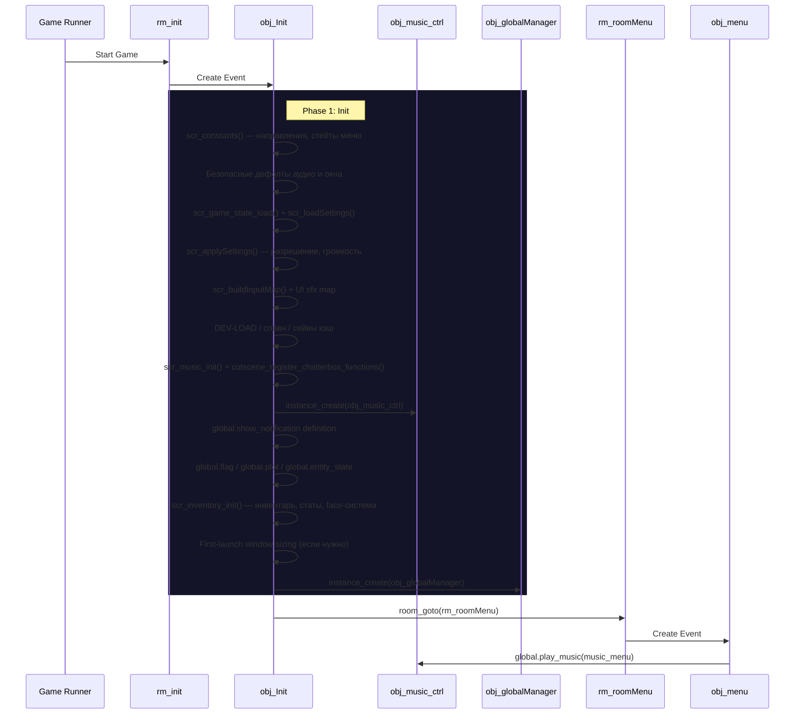

---
tags:
  - init
  - runtime
  - persistent-objects
---

# Инициализация и Runtime (Initialization)

Стартовая цепочка загрузки и распределение ответственности между `obj_Init` и `obj_globalManager`.

## Обзор (Overview)

В проекте используется централизованная инициализация: `obj_Init` отвечает за холодный старт, а `obj_globalManager` — за поддержку рантайма после загрузки.

### Диаграмма запуска (Startup Flow)


```mermaid
sequenceDiagram
    participant Runner as Game Runner
    participant R_Init as rm_init
    participant O_Init as obj_Init
    participant O_Music as obj_music_ctrl
    participant O_Global as obj_globalManager
    participant R_Menu as rm_roomMenu
    participant O_Menu as obj_menu

    Runner->>R_Init: Start Game
    R_Init->>O_Init: Create Event

    rect rgb(20, 20, 40)
        note right of O_Init: Phase 1: Init
        O_Init->>O_Init: scr_constants() — направления, стейты меню
        O_Init->>O_Init: Безопасные дефолты аудио и окна
        O_Init->>O_Init: scr_game_state_load() + scr_loadSettings()
        O_Init->>O_Init: scr_applySettings() — разрешение, громкость
        O_Init->>O_Init: scr_buildInputMap() + UI sfx map
        O_Init->>O_Init: DEV-LOAD / спавн / сейвы кэш
        O_Init->>O_Init: scr_music_init() + cutscene_register_chatterbox_functions()
        O_Init->>O_Music: instance_create(obj_music_ctrl)
        O_Init->>O_Init: global.show_notification definition
        O_Init->>O_Init: global.flag / global.plot / global.entity_state
        O_Init->>O_Init: scr_inventory_init() — инвентарь, статы, face-система
        O_Init->>O_Init: First-launch window sizing (если нужно)
        O_Init->>O_Global: instance_create(obj_globalManager)
    end

    O_Init->>R_Menu: room_goto(rm_roomMenu)
    R_Menu->>O_Menu: Create Event
    O_Menu->>O_Music: global.play_music(music_menu)
```

## Порядок запуска

| # | Шаг | Код / Функция | Описание |
|---|-----|---------------|----------|
| 1 | **`rm_init`** | — | Первая комната. Содержит `obj_Init` для стартовой загрузки. |
| 2 | **`obj_Init` защита от дублей** | `global.__init_done` | `persistent = true`; если инициализация уже была — выходим, дубликаты уничтожаем. |
| 3 | **Базовые флаги** | — | `global.clean_state`, `global.tester_mode`, `global.room_flags`. |
| 4 | **Константы** | `scr_constants()` | `global.DIR`, `global.SETTINGS_STATE`. |
| 5 | **Первый запуск и дебаг** | — | `global.settings_file`, `_is_first_launch`, `global.debug`, `global.debug_show_music`. |
| 6 | **Безопасные дефолты аудио** | — | `global.__current_master_volume`, `global.__music_volume`, `global.__sfx_volume`, плейсхолдеры `global.music_instance` и `global.__music_get_settings_volume`. |
| 7 | **Безопасные дефолты окна** | — | `global.__window_prev_*`, `global.__window_borderless_active`. |
| 8 | **Состояние и настройки** | `scr_game_state_load()` + `scr_loadSettings()` + `scr_applySettings()` | `global.game_state_file`, `global.game_state`, счётчики playtime, `global.player_settings`. Если в настройках включён debug — активируем `global.debug`. |
| 9 | **Ввод и UI звуки** | `scr_buildInputMap()` | `global.input_map`, `global.input_repeater_defaults`, `global.__input_repeat_state`, `global.ui_snd_select`, `global.ui_sfx_map`. |
| 10 | **DEV-LOAD и спавн** | — | `global.__dev_spawn*`, `global.obj_player`, `global.__next_spawn_*`, `global.__transition_safety_frames`. |
| 11 | **Debug-флаги и шейдер меню** | — | `global.debug_show_info`, `global.debug_show_colliders`, `global.debug_show_hitbox`, `global.__debug_activation_*`, `global.__menu_shader_*`. |
| 12 | **Катсцены и UI-состояние** | — | `global.cutscene_active`, `global.active_cutscene_id`, `global.active_cutscene_manager`, `global.cutscene_camera_override`, `global.__cutscene_build_mgr`, `global.__cutscene_action_factory`, `global.__interacted_targets`, `global.settings_closing`, `global.menu_return_focus`, `global.ingame_menu_return_index`. |
| 13 | **Сервисные комнаты и реестр комнат** | — | `global.__service_menu_rooms`, `global.is_menu_room()`, `global.rooms_by_name`. |
| 14 | **Слоты сохранений и кэш метаданных** | — | `global.current_save_slot`, `global.last_played_save_slot`, `global.__save_slot_names`, `global.__save_slot_metadata_cache` — читаем «шапку» каждого `saveN.txt`. |
| 15 | **Emote system** | — | `global.global_emote_system`. |
| 16 | **Музыкальная система** | `scr_music_init()` | Инициализация всех music-глобалов и функций: `global.play_music()`, `global.play_music_fade()`, `global.play_music_immediate()`, ducking, layered mode. |
| 17 | **Chatterbox интеграция** | `cutscene_register_chatterbox_functions()` + `ChatterboxLoadFromFile("testDialogue.yarn")` | Регистрация всех `c_*` команд катсцен как Yarn-функций и загрузка стартового диалога. |
| 18 | **Создание музыкального контроллера** | — | `obj_music_ctrl` (persistent) — обновляет фейды каждый кадр. |
| 19 | **Уведомления** | — | Определяется `global.show_notification(text)` — пишет в `obj_globalManager.notification_*`. |
| 20 | **Первый запуск** | — | Если `player_settings.dat` не существовал — подгоняем размер окна под экран и центрируем. |
| 21 | **Создание глобального менеджера** | — | `obj_globalManager`. |
| 22 | **Переход в меню** | `room_goto(rm_roomMenu)` | Если мы в `rm_init`. |
| 23 | **Сюжет и прогресс** | — | `global.flag = {}`, `global.plot = 0`. |
| 24 | **Реестр состояния сущностей** | — | `global.entity_state = {}` — хранит состояние NPC, дверей, сундуков по ключу `"room_name:entity_id"`. |
| 25 | **Инвентарь, статы, камера, face system** | `scr_inventory_init()` | `global.inventory` (8 слотов), `global.equipped_weapon`, `global.equipped_armor`, статы, `global.camera_*`, `global.current_*`, `global.is_talking`. |
| 26 | **Музыка меню** | `global.play_music(music_menu)` | Запускается из `obj_menu.Create` (или `obj_p3r_title.Create`), а не из `obj_Init`. |

## Роли объектов

### `obj_Init`
- **Тип**: Singleton, Persistent.
- **Ответственность**: холодный старт и подготовка **всех** глобальных данных до начала обычного gameplay.
- **Жизненный цикл**: создаётся в `rm_init`, защищён от дублей (`global.__init_done`) и нужен для корректного старта даже при нестандартном запуске.
- **Что инициализирует**: константы, аудио-дефолты, окно-дефолты, `game_state`, `player_settings`, input map, UI sfx, DEV-LOAD переменные, debug-флаги, катсценные глобалы, UI-состояние, реестр комнат, кэш сейвов, emote system, музыкальную систему, Chatterbox-функции катсцен и стартовый диалог, уведомления, `room_flags`, `flag`, `plot`, `entity_state`, инвентарь, статы, камеру, диалог face-систему.

### `obj_globalManager`
- **Тип**: Singleton, Persistent.
- **Ответственность**: runtime-поддержка **после** завершения init-фазы.
- **Основные задачи**:
  - Следить за сменой комнат (`current_room` + `scr_global_on_room_change`).
  - Обрабатывать debug-хоткеи (F1–F12) и быстрый сейв (F7).
  - Управлять уведомлениями (`notification_active`, `notification_text`, `notification_timer`).
  - DEV-LOAD спаун игрока (`scr_global_handle_dev_spawn`).
  - Runtime катсцен: tweens, emotes, shakes, spins, jumps, fade.
  - Сброс флага `global.settings_closing`.
  - Переключение полноэкранного режима (Q).
  - Таймер безопасности после перехода (`scr_global_transition_safety`).
  - Вызов внутриигрового меню (`scr_callMenuInit`).

!!! note "Музыка не здесь"
    Музыкальные фейды управляются отдельным объектом `obj_music_ctrl` (создаётся из `obj_Init`). `obj_globalManager` НЕ содержит music-глобалов.

## Fallback (Страховка)

В `rooms/GlobalRoomCreationCode.gml` (выполняется в **каждой** комнате) есть fallback-логика на случай запуска не через стандартную цепочку `rm_init -> obj_Init -> rm_roomMenu`:

```gml title="GlobalRoomCreationCode.gml"
if (!instance_exists(obj_Init)) {
    instance_create_depth(0, 0, -10000, obj_Init);
}
if (!instance_exists(obj_globalManager)) {
    instance_create_depth(0, 0, -10000, obj_globalManager);
}
```

Если игра стартовала сразу с комнаты или уровня, fallback принудительно создаёт `obj_Init`, чтобы глобальные системы успели инициализироваться. Защита `global.__init_done` внутри `obj_Init.Create` предотвращает двойной запуск.

---

## См. также

- [Глобальное состояние](global-state.md)
- [Объекты системы](objects.md)
- [Комнаты](rooms.md)
- [Система музыки](../systems/music.md) — `scr_music_init()`, `global.play_music()`