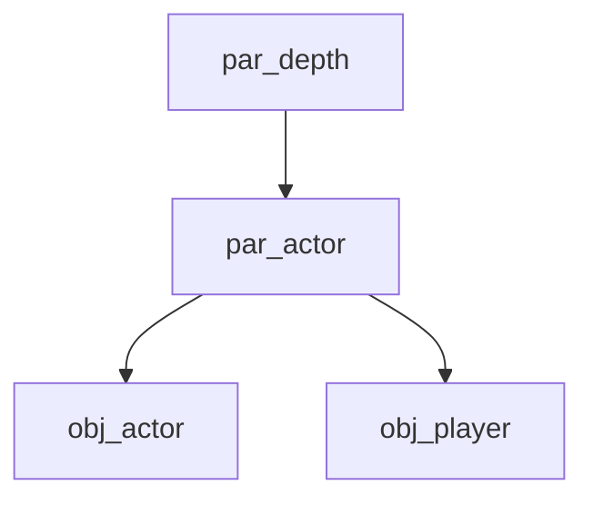

---
tags:
  - cutscenes
  - actors
---

# Катсцены: Актёры

Реестр и управление участниками сцены: игроком, NPC и временными инстансами.

## Реестр актёров
- `actor_map`: структура сопоставления `key -> instance`.
- Итерация через `variable_struct_get_names(actor_map)`.

## Создание актёров (`cutscene_actor_create`)
- `key`: строковый идентификатор.
- `sprite_or_object`: ассет спрайта или объекта.
- `copy_from_object`: опциональный источник для копирования свойств (scale, blend, facing). **Depth не копируется** — проект использует isometric sorting (`depth = -y`).

### Поведение ActionActorCreate
1. Если передан ассет объекта — создается этот объект.
2. Если передан спрайт — создается `obj_actor` с этим спрайтом.
3. Копирование свойств не клонирует `object_index` — актёр всегда остается `obj_actor`.

## Иерархия актёров

- `par_depth` — управляет Z-сортировкой через `depth_mode` (`auto`, `manual`, `static`, `attached`).
- `par_actor` — добавляет tween-based movement system (`move_active`, `target_x/y`).

## Глубина (`depth_mode`)

| Режим | Поведение | Когда использовать |
|-------|-----------|-------------------|
| `auto` | `depth = -y` каждый кадр | Движущиеся актёры (по умолчанию) |
| `manual` | Глубина задаётся внешним кодом | Катсцены, скрипты |
| `static` | Глубина заморожена при спавне | Декорации |
| `attached` | Копируется из `attached_target + depth_offset` | Прикреплённые объекты |

`ActionSetDepth(target, depth)` переключает `depth_mode` в `manual` перед установкой значения.

## Групповые операции (`ActionGroup`)
Применение экшена к массиву целей:
- `c_move_group`: групповое перемещение.
- `c_walk_group`: групповая ходьба.
- `c_var_group`: массовая установка свойств.
- `c_tween_group`: массовая анимация параметров.

## Рекомендации
- Используйте **instance id** для надежности в сложных сценах.
- При создании NPC через катсцену всегда указывайте `obj_actor` или наследники.

---

## См. также

- [Обзор катсцен](overview.md) — `obj_cutsceneManager`, `action_queue`
- [Архитектура](architecture.md) — `actor_map`, `resolve_target`
- [API](api.md) — `cutscene_actor_create`, `ActionActorCreate`
- [Камера](camera.md) — `ActionCameraTrack` для слежения за актёрами