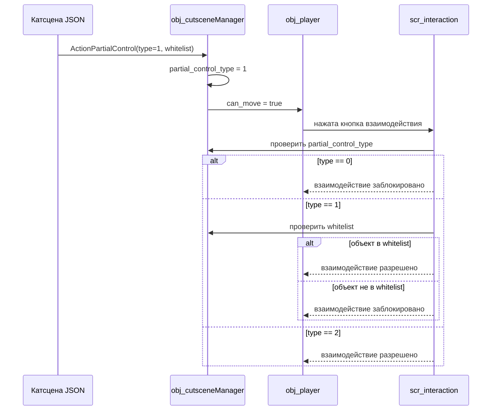
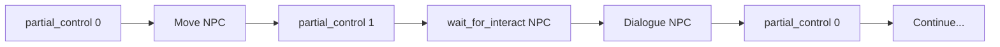

---
tags:
  - cutscenes
  - cutscene-api
  - gameplay
  - controls
---

# Partial Player Control & World Changes

Управление уровнем контроля игрока во время катсцен и механизмы изменения мира после их завершения.

## Обзор

По умолчанию катсцена полностью блокирует движение и взаимодействие игрока. Система partial control переключает уровень свободы через action `partial_control`, а действия `spawn_entity`, `destroy_entity`, `set_flag`, `set_plot` меняют состояние мира прямо из катсцены или при входе в комнату.

## Частичный контроль игрока

### Типы контроля

Action `partial_control` принимает параметр `type`:

| `type` | Движение | Взаимодействие | Поведение |
|--------|----------|----------------|-----------|
| `0` | :material-cancel: | :material-cancel: | Катсцена полностью контролирует игрока |
| `1` | :material-check: | Whitelist | Движение разрешено, взаимодействие — только с объектами из `whitelist` |
| `2` | :material-check: | :material-check: | Полная свобода, катсцена идёт в фоне |

### Параметры

| Параметр | Тип | Обязательный | Описание |
|----------|-----|---------------|----------|
| `type` | `0 \| 1 \| 2` | :material-check: | Уровень контроля |
| `whitelist` | `string[]` | при `type=1` | Список ключей объектов (`actor_map`), с которыми разрешено взаимодействие |

### Примеры

=== "Type 0 — нет контроля"

    ```json title="partial_control type 0" linenums="1"
    {
      "action": "partial_control",
      "type": 0
    }
    ```

=== "Type 1 — whitelist"

    ```json title="partial_control type 1 (whitelist)" linenums="1"
    {
      "action": "partial_control",
      "type": 1,
      "whitelist": ["npc_merchant", "quest_board"]
    }
    ```

=== "Type 2 — полная свобода"

    ```json title="partial_control type 2" linenums="1"
    {
      "action": "partial_control",
      "type": 2
    }
    ```

### Runtime-механика



- **`ActionPartialControl`** — устанавливает `partial_control_type` и `partial_control_whitelist` на `obj_cutsceneManager`
- **`scr_player_ui_blocking`** — проверяет `partial_control_type`, разрешает движение при `type > 0`
- **`scr_interaction`** — проверяет whitelist при `type == 1`, блокирует взаимодействие с неразрешёнными объектами

!!! tip "Переход между типами"
    Можно использовать несколько `partial_control` actions подряд внутри одной катсцены. Например: сначала `type=0` (катсцена идёт), затем `type=1` (игрок может подойти к NPC), затем снова `type=0`.

## Ожидание взаимодействия

Action `wait_for_interact` приостанавливает катсцену, пока игрок не провзаимодействует с целевым объектом.

### Параметры

| Параметр | Тип | Обязательный | Описание |
|----------|-----|---------------|----------|
| `target` | `string` | :material-check: | Ключ объекта в `actor_map` |
| `timeout` | `number` | | Таймаут в секундах, `0` = бесконечно |

### Пример

```json title="wait_for_interact" linenums="1"
{
  "action": "wait_for_interact",
  "target": "quest_board",
  "timeout": 30
}
```

### Как работает

1. `ActionWaitForInteract` резолвит `target` через `__cutscene_resolve_target` и сохраняет в `resolved_target`
2. Катсцена ждёт — `update` возвращает `false` каждый кадр
3. Когда `scr_interaction` фиксирует взаимодействие с нужным объектом — устанавливает `__wait_interact_target` на менеджере
4. `update` видит совпадение — возвращает `true`, катсцена продолжается
5. При таймауте — `update` возвращает `true` независимо от взаимодействия

!!! warning "Только при type > 0"
    `wait_for_interact` имеет смысл только после `partial_control` с `type=1` или `type=2`. При `type=0` игрок не может взаимодействовать — действие зависнет до таймаута.

## Изменение мира

### Set Flag

Устанавливает значение в `global.flag` — структуре для хранения произвольных флагов прогресса.

| Параметр | Тип | Обязательный | Описание |
|----------|-----|---------------|----------|
| `key` | `string` | :material-check: | Ключ флага |
| `value` | `any` | :material-check: | Значение (bool, number, string) |

```json title="set_flag" linenums="1"
{
  "action": "set_flag",
  "key": "quest_1_complete",
  "value": true
}
```

### Set Plot

Устанавливает `global.plot` — числовой прогресс сюжета.

| Параметр | Тип | Обязательный | Описание |
|----------|-----|---------------|----------|
| `value` | `number` | :material-check: | Новое значение `global.plot` |

```json title="set_plot" linenums="1"
{
  "action": "set_plot",
  "value": 5
}
```

### Spawn Entity

Создаёт объект в runtime через `instance_create_depth`. Объект должен существовать в проекте как asset.

| Параметр | Тип | Обязательный | Описание |
|----------|-----|---------------|----------|
| `object` | `string` | :material-check: | Имя объекта (asset name) |
| `x` | `number` | :material-check: | Координата X |
| `y` | `number` | :material-check: | Координата Y |
| `key` | `string` | | Ключ в `actor_map` для последующих ссылок |
| `depth` | `number` | | Глубина слоя (default `0`) |
| `persistent` | `boolean` | | Объект сохраняется при смене комнаты |

```json title="spawn_entity" linenums="1"
{
  "action": "spawn_entity",
  "object": "obj_npc_guard",
  "x": 128,
  "y": 256,
  "key": "guard_1",
  "depth": 0,
  "persistent": false
}
```

!!! tip "Подготовка объекта"
    Объект должен быть заранее создан в проекте с нужными событиями (Step, диалоги, коллизии). `spawn_entity` только создаёт инстанс — вся логика уже прописана в объекте.

### Destroy Entity

Уничтожает инстанс объекта через `instance_destroy`.

| Параметр | Тип | Обязательный | Описание |
|----------|-----|---------------|----------|
| `target` | `string` | :material-check: | Ключ в `actor_map` или имя объекта |

```json title="destroy_entity" linenums="1"
{
  "action": "destroy_entity",
  "target": "guard_1"
}
```

!!! danger "Нельзя уничтожить игрока"
    Попытка уничтожить `obj_player` через `destroy_entity` игнорируется с предупреждением в debug log.

## Постоянные изменения при входе в комнату

`scr_room_entry_check()` проверяет `global.room_flags` при входе в комнату и создаёт объекты, которые должны там находиться. Это механизм для persistent-изменений мира — объектов, появившихся после катсцены и остающихся при повторном посещении комнаты.

### Структура `global.room_flags`

```gml title="Пример заполнения room_flags" linenums="1"
global.room_flags = {
  "rm_village": [
    { object: "obj_npc_guard", x: 128, y: 256, depth: 0 },
    { object: "obj_chest", x: 200, y: 100, depth: 0 }
  ]
};
```

### Когда вызывать

- Из события **Room Start**
- Из `obj_globalManager.Step_0` при детекте смены комнаты
- После загрузки сейва

### Защита от дубликатов

`scr_room_entry_check` проверяет, не создан ли уже инстанс объекта с такими же координатами, перед созданием нового.

## Ноды в Undefscene

| Нода | Категория | Обязательные параметры | Опциональные параметры |
|------|-----------|------------------------|------------------------|
| `partial_control` | logic | `type` | `whitelist` |
| `wait_for_interact` | logic | `target` | `timeout` |
| `set_flag` | logic | `key`, `value` | — |
| `set_plot` | logic | `value` | — |
| `spawn_entity` | logic | `object`, `x`, `y` | `key`, `depth`, `persistent` |
| `destroy_entity` | logic | `target` | — |

## Типовые сценарии

### Катсцена с NPC-диалогом в середине



1. Катсцена двигает NPC на позицию — игрок не может двигаться
2. Переключение на `type=1` — игрок подходит к NPC (whitelist)
3. `wait_for_interact` — катсцена ждёт, пока игрок нажмёт кнопку рядом с NPC
4. Диалог с NPC
5. Возврат к `type=0` — катсцена продолжается

### Появление объекта после катсцены

1. В катсцене: `set_flag` `"village_guard_spawned" = true`
2. В катсцене: `spawn_entity` `obj_npc_guard` на нужной позиции
3. В Room Start `rm_village`: `scr_room_entry_check()` — если флаг установлен, объект создаётся при каждом входе

## См. также

- [Архитектура катсцен](architecture.md) — общая структура action-системы
- [Актёры](actors.md) — `actor_map`, `resolve_target`, работа с ключами
- [Игрок в катсцене](player_in_cutscene.md) — `can_move`, `scr_player_ui_blocking`
- [API справочник](api.md) — полный список действий и параметров
