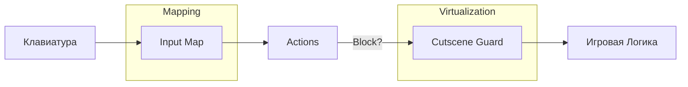

# Система Ввода (Input System)

Игра использует единый API ввода (`scr_inputApi`), который абстрагирует физические клавиши от игровых действий.

## Архитектура Ввода



## Основные Понятия

*   **Action (Действие)**: Строковый ID действия (например, `"confirm"`, `"jump"`, `"menu"`).
*   **Input Map**: Глобальная структура `global.input_map`, связывающая Action с физическими клавишами (поддерживается до 2 клавиш на действие).
*   **Input Repeater**: Система для повторения нажатий (как при печати текста) для навигации в меню.

## API Справочник

### Построение карты ввода

#### `scr_buildInputMap(settings)`
Создаёт структуру `global.input_map` из `global.player_settings`. Вызывается в `obj_Init` и после каждого rebind.

```gml
global.input_map = scr_buildInputMap(global.player_settings);
// Результат: { "up": [vk_up, -1], "confirm": [ord("Z"), vk_enter], ... }
```

### Проверка ввода

#### `scr_input_pressed(action)`
Возвращает `true`, если действие было активировано в *этом* кадре.
```gml
if (scr_input_pressed("confirm")) {
    // подтверждение
}
```

#### `scr_input_down(action)`
Возвращает `true`, пока кнопка действия удерживается.
```gml
if (scr_input_down("back")) {
    // бег или назад
}
```

#### `scr_input_repeater(action, [delay, interval])`
Возвращает `true` периодически, если кнопка удерживается. Идеально для списков меню.
*   `delay`: Задержка перед началом повтора (мс, default из `global.input_repeater_defaults.delay = 200`).
*   `interval`: Частота повторов (мс, default из `global.input_repeater_defaults.interval = 120`).

### Блокировка Катсценами
Функция `scr_input__is_cutscene_blocked_here()` проверяет, идёт ли катсцена.
*   Если **Да**: Ввод перехватывается. Игрок не получает `true` от `scr_input_pressed`, если только катсцена не "нажимает" кнопки виртуально (через `__cutscene_virtual_down`).
*   **Исключения**: UI объекты и менеджер катсцен игнорируют блокировку:
    *   `textboxTest_scribble`
    *   `obj_settingsManager`
    *   `obj_menu`
    *   `obj_saveManager`
    *   `obj_inGameMenu`
    *   `obj_cutsceneManager`

### Переназначение (Rebinding)

#### `scr_input_rebind(action, new_key)`
Переназначает основной слот (slot 1) действия. Удаляет `new_key` из всех конфликтующих действий, сохраняет и пересобирает `input_map`.

*   Для действия `"menu"` автоматически назначает `vk_escape` на slot 2.

```gml
scr_input_rebind("confirm", vk_space);
```

#### `scr_input_rebind_slot(action, slotIndex, new_key, [target_settings])`
Переназначает конкретный слот клавиши. Защищает дефолтные клавиши от конфликтной перезаписи (swap-логика).

!!! warning "Всегда пишет в slot 1"
    В текущей реализации функция всегда записывает в `input_<action>1`, даже если `slotIndex = 2`. Параметр `slotIndex` используется только для проверки дефолтности клавиши и поиска конфликтов.

```gml
// Назначить Пробел на primary-slot действия "confirm"
scr_input_rebind_slot("confirm", 1, vk_space);
```