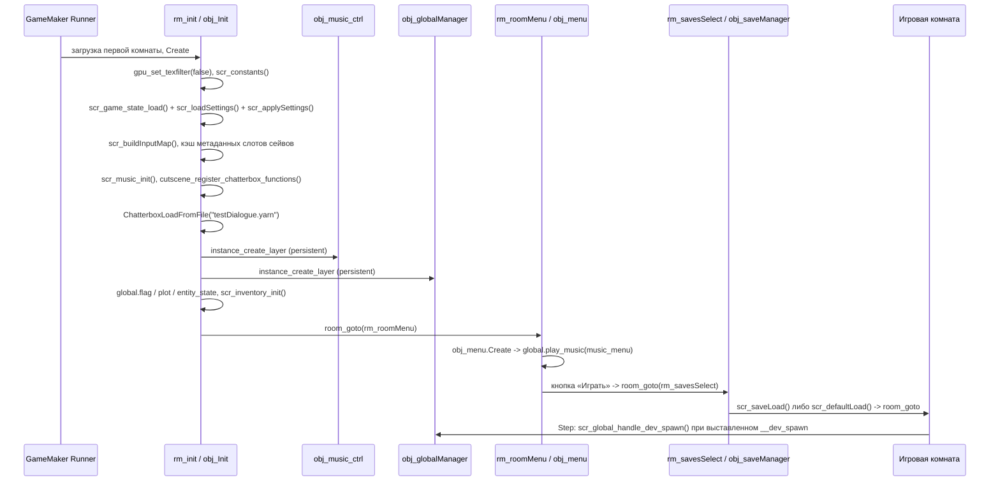

# Инициализация

Стартовая цепочка Undefinedtale-888: первая комната `rm_init` содержит единственный инстанс `obj_Init`, который в событии Create инициализирует все `global.*`, создаёт persistent-менеджеры и переводит игру в `rm_roomMenu`.

## Обзор

`rm_init` — первый узел `RoomOrderNodes` в `Undefinedtale888.yyp`. Вся холодная инициализация сосредоточена в `obj_Init/Create_0.gml`; `obj_globalManager` и `obj_music_ctrl` создаются оттуда же через `instance_create_layer` на слой `"Instances"` (`scr_layer_ensure_instances`).

## Комната rm_init

| Свойство | Значение |
|----------|----------|
| Размер | 1280×980 |
| Слои | `Instances` (depth 0) и `Background` (depth 100, чёрная заливка `0xFF000000`) |
| Инстансы | `obj_Init` (`inst_369CFEE7`, позиция 640×352) — ровно один |
| Views | выключены (`enableViews: false`) |

`rm_init` — служебный тупик без меню-поведения: она не входит в `global.__service_menu_rooms`, но отдельно исключена из dev-навигации — `scr_room_is_dev_navigation_excluded` возвращает `true` для `"rm_init"`, поэтому F5/F6-прыжки и список DEV-LOAD её пропускают. Переход из комнаты зашит в конце `obj_Init.Create`: `room_goto(rm_roomMenu)`.

## obj_Init.Create: порядок инициализации

`obj_Init` — `persistent` (выставлено и в `.yy`, и первой строкой Create), без спрайта, с единственным событием Create. Первым делом проверяется `global.__init_done`: при повторном запуске событие выходит, а лишний экземпляр самоуничтожается. Флаг выставляется последней строкой события — если инициализация прервётся раньше, следующий экземпляр выполнит её заново.

| # | Блок | Код / функция | Что создаёт |
|---|------|---------------|-------------|
| 1 | Рендер | `gpu_set_texfilter(false)` | nearest-neighbor фильтрацию для pixel-art |
| 2 | Базовые флаги | — | `global.clean_state`, `global.room_flags` (сессионные пост-катсценные пометки, в сейв не входят) |
| 3 | Константы | `scr_constants()` | `global.DIR`, `global.SETTINGS_STATE` (read-only по соглашению) |
| 4 | Первый запуск | — | `global.settings_file = "player_settings.dat"`, локальный `_is_first_launch`; `global.debug = false`, `global.debug_show_music` |
| 5 | Дефолты аудио | — | `global.__current_master_volume`, `__music_volume`, `__sfx_volume`, плейсхолдеры `__music_get_settings_volume` и `music_instance` — нужны до `scr_applySettings` |
| 6 | Дефолты окна | — | `global.__window_prev_x/y/w/h`, `__window_borderless_active` |
| 7 | Состояние игры | `scr_game_state_load()` | `global.game_state_file`, `global.game_state`, счётчики `__save_playtime_seconds` и `__total_playtime_seconds` |
| 8 | Настройки | `scr_loadSettings()` → `scr_applySettings()` | `global.player_settings`; применяет окно и громкость; `global.debug = player_settings.debug_enabled` |
| 9 | Ввод | `scr_buildInputMap(global.player_settings)` | `global.input_map`, `input_repeater_defaults` (`delay: 200`, `interval: 120`), `__input_repeat_state`, `__gamepad_axis_prev` / `__gamepad_axis_pressed` |
| 10 | SFX интерфейса | — | `global.ui_snd_select`, `global.ui_sfx_map` (все действия — `snd_text_ch1`, единственный задействованный SFX-ассет; `snd_wobble` в проекте есть, но не вызывается) |
| 11 | Спавн и DEV-LOAD | — | `global.__dev_spawn`, `__dev_spawn_x/y` (`__dev_spawn_facing` намеренно не инициализируется — писатели ставят его в том же кадре), `global.obj_player`, `__next_spawn_x/y/facing`, `__transition_safety_frames` |
| 12 | Debug | — | `debug_show_info`, `debug_show_colliders`, `debug_show_hitbox`, `__debug_activation_*`, `__menu_shader_*` |
| 13 | Катсцены | — | `cutscene_active`, `active_cutscene_id`, `active_cutscene_manager`, `cutscene_camera_override`, `__cutscene_build_mgr`, `__cutscene_action_factory`, `__interacted_targets`, `__cutscene_checkpoints`, `__cutscene_attachments` |
| 14 | UI-состояние | — | `menu_return_focus`, `ingame_menu_return_index`, кэш `__ui_blocking_*` (оба dirty-флага в `true` выставляет `obj_globalManager` в начале Step) |
| 15 | Реестры комнат | — | `global.__service_menu_rooms`, функция `global.is_menu_room()`, карта `global.rooms_by_name` (цикл по `room_first`/`room_next`) |
| 16 | Слоты сейвов | — | `global.current_save_slot`, `last_played_save_slot` (приоритет: `game_state` → `last_played` → `"save1"`); кэш `__save_slot_metadata_cache` по списку `scr_save_slot_names()` через `scr_save_metadata_defaults` + `scr_save_read_metadata` |
| 17 | Эмоции и музыка | инлайн + `scr_music_init()` | `global.global_emote_system` (инлайн); все `global.music_*` и функции `play_music*`/`stop_music`/`set_music_pitch` — из `scr_music_init` |
| 18 | Chatterbox | `cutscene_register_chatterbox_functions()` + `ChatterboxLoadFromFile()` | `global.__cutscene_chatterbox_registered` (инлайн `false`, функция выставляет `true`); загрузка `testDialogue.yarn` |
| 19 | Контроллер музыки | — | `obj_music_ctrl` (persistent), если его ещё нет |
| 20 | Уведомления и первый запуск | — | функция `global.show_notification()`; при `_is_first_launch` — подгон окна под экран, центрирование, `scr_saveSettings` |
| 21 | Глобальный менеджер | — | `obj_globalManager` (persistent), если его ещё нет |
| 22 | Прогресс | инлайн + `scr_inventory_init()` | `global.flag`, `global.plot`, `global.entity_state` (инлайн до вызова); `scr_inventory_init` — инвентарь на 8 слотов со стартовыми предметами, `equipped_weapon`/`equipped_armor`, статы `stat_*`, `player_name`, `camera_x/y`, `current_sprite`, `current_voice` |
| 23 | Переход | `room_goto(rm_roomMenu)` | Только если `room == rm_init`; вызов стоит последним — движок откладывает переход до конца события |
| 24 | Финал | — | `global.__init_done = true` |

!!! note "Глобал вне конвейера"
    `global.default_settings` — единственный глобал вне `obj_Init`: его присваивает код верхнего уровня `scr_settingsManager.gml` при загрузке программы, до первой комнаты. `scr_loadSettings` копирует его как базу дефолтов.

## obj_globalManager

Создаётся из `obj_Init` (шаг 21) и живёт между комнатами (`persistent`). События по `obj_globalManager.yy`:

| Событие | Файл | Роль |
|---------|------|------|
| Create | `Create_0.gml` | Защита от дубликата (`instance_number > 1` → destroy); `current_room = room`; поля уведомлений `notification_*`; массивы `cutscene_runtime_tweens/shakes/spins/jumps`, struct `cutscene_runtime_fade` |
| Step | `Step_0.gml` | Guard по `__init_done`; инвалидация кэша `__ui_blocking_*`; `scr_input_gamepad_update`; детект смены комнаты → `scr_global_on_room_change` + `scr_room_entry_check`; `scr_debug_activation_check`; `scr_global_debug_hotkeys`; `scr_global_handle_dev_spawn`; `scr_global_handle_notifications`; `emote_step`; `cutscene_runtime_step`; полноэкранный режим (Q, только в debug); `scr_global_transition_safety`; накопление playtime вне меню-комнат; `scr_callMenuInit` |
| End Step | `Step_2.gml` | Обновляет `global.camera_x/y` из `view_camera[0]` после движения игрока; в комнатах без views пропускается |
| Draw GUI | `Draw_64.gml` | Уведомления, debug-оверлеи F1/F2/F3, `emote_draw_gui`, `cutscene_runtime_draw_gui` |
| Game End | `Other_3.gml` | Записывает `total_playtime_seconds` в `game_state.dat` через `scr_game_state_save`; пропускается при `global.clean_state` |

События Room Start у `obj_globalManager` нет: смена комнаты отслеживается в Step сравнением `room != current_room`, а спавн игрока — через `scr_global_handle_dev_spawn` по флагу `global.__dev_spawn`.

!!! warning "Старт не через rm_init"
    `obj_Init` создаётся только расстановкой в `rm_init` — программных `instance_create` для него в коде нет. При запуске игры сразу в другой комнате глобалы и `obj_globalManager` не появятся; если менеджер всё же существует, его Step пропускает кадр по проверке `__init_done`.

## scr_defaultLoad — сценарий «новой игры»

Вызывается из `obj_saveManager/Step_0.gml`, когда выбранный слот пуст. Порядок:

1. Проверяет стартовую комнату: `scr_roomFromName("rm_uphill_school")` + `room_exists`. При битом ассете снимает `__next_spawn_*`, пишет warning и возвращает `false` — меню остаётся открытым.
2. Сбрасывает сессионное состояние: `__save_playtime_seconds`, `flag`, `plot`, `entity_state`, `room_flags`, `__interacted_targets`, затем `scr_inventory_init()` и `ChatterboxVariablesResetAll`/`ChatterboxVariablesClearVisitedAll` в `try`.
3. Выставляет `global.__next_spawn_*` = `(377, 187)` с `global.DIR.DOWN` — их прочитает Create `obj_player`.
4. Уничтожает существующих `obj_player` и `obj_changingRoomsController`.
5. `room_goto(rm_uphill_school)` и страховочный `global.__dev_spawn` — если в целевой комнате нет расставленного игрока, `scr_global_handle_dev_spawn` создаст его на следующем Step.

Ветка с существующим сейвом идёт через `scr_saveLoad` — см. [Система сохранений](../systems/save-system.md).

## scr_get_next_game_room — dev-навигация по комнатам

`scr_get_next_game_room(direction)` возвращает следующую (`1`) или предыдущую (`-1`) комнату по `room_next`/`room_previous`, пропуская имена из `scr_room_is_dev_navigation_excluded`: все комнаты `global.__service_menu_rooms`, `rm_init` и `SCREENSHOTS`. Единственный вызов — `__debug_jump_room` в `scr_global_debug_hotkeys` (F5/F6), который перед `room_goto` выставляет `__dev_spawn` с `undefined`-координатами (спавн в центре целевой комнаты).

## Что гарантировано к Create игрока

`obj_player` (persistent) либо расставлен в игровой комнате, либо создаётся `scr_global_handle_dev_spawn`. К моменту его Create выполнены:

- `global.__init_done == true` — `room_goto` из `rm_init` срабатывает только после конца Create `obj_Init`;
- все `global.*` из таблицы выше: `input_map`, `flag`, `plot`, `entity_state`, инвентарь и статы, `is_menu_room()`, `music_*`, debug-флаги;
- существуют `obj_globalManager` и `obj_music_ctrl`;
- `global.__next_spawn_x/y/facing` заполнены, если идёт загрузка сейва или «новая игра» — Create игрока читает и обнуляет их, иначе использует `global.DIR.UP`;
- `global.obj_player = id` игрок выставляет сам в своём Create (до unstuck-поиска и создания маркера).

## См. также

- [Глобальное состояние](global-state.md) — реестр `global.*`
- [Комнаты](rooms.md) — слои, переходы, сервисные комнаты
- [Иерархия объектов](object-hierarchy.md) — `obj_Init`, `obj_globalManager`, `obj_player`
- [Система сохранений](../systems/save-system.md) — `scr_saveLoad`, слоты, `game_state.dat`
- [Музыка](../systems/music.md) — `scr_music_init`, `obj_music_ctrl`
- [Ввод](../systems/input.md) — `input_map`, ребинды, геймпад
- [Отладка и тестирование](../systems/debug-and-testing.md) — F-клавиши, DEV-LOAD

<!-- sources: objects/obj_Init/Create_0.gml:1-354; objects/obj_Init/obj_Init.yy; rooms/rm_init/rm_init.yy; Undefinedtale888.yyp (RoomOrderNodes); objects/obj_globalManager/{Create_0,Step_0,Step_2,Draw_64,Other_3}.gml; objects/obj_globalManager/obj_globalManager.yy; scripts/scr_defaultLoad/scr_defaultLoad.gml; scripts/scr_get_next_game_room/scr_get_next_game_room.gml; scripts/scr_global_handle_dev_spawn/scr_global_handle_dev_spawn.gml; scripts/scr_inventory_init/scr_inventory_init.gml; scripts/scr_music_init/scr_music_init.gml:1-94; scripts/scr_constants/scr_constants.gml; scripts/scr_settingsManager/scr_settingsManager.gml:1-75,80-134,262-314,442-457; scripts/scr_game_state/scr_game_state.gml; scripts/scr_layer_ensure_instances/scr_layer_ensure_instances.gml; scripts/scr_global_debug_hotkeys/scr_global_debug_hotkeys.gml:1-40; scripts/scr_global_on_room_change/scr_global_on_room_change.gml:1-20; objects/obj_saveManager/Step_0.gml:100-159; objects/obj_menu/Create_0.gml; objects/obj_player/Create_0.gml; docs_new/_meta/rooms.txt; docs_new/_meta/objects.txt -->
