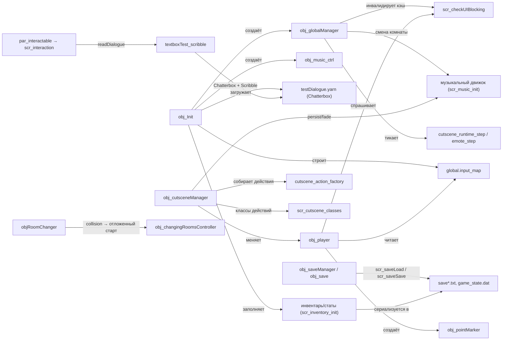

# Обзор архитектуры

Карта подсистем Undefinedtale-888: кто кого создаёт, кто кого читает и в каком порядке
объекты исполняются в кадре. Источник истины — код проекта; страница служит оглавлением
для детальных разделов.

## Подсистемы { #subsystems }

| Подсистема | Ключевые файлы | Страница |
|------------|----------------|----------|
| Инициализация | `objects/obj_Init/Create_0.gml`, `scripts/scr_constants` | [Инициализация](initialization.md) |
| Глобальное состояние, UI-блокировка | `objects/obj_globalManager/*`, `scripts/scr_checkUIBlocking` | [Глобальное состояние](global-state.md) |
| Ввод (клавиатура + геймпад) | `scripts/scr_inputApi`, `scr_buildInputMap` (в `scr_settingsManager`), `global.input_map` | [Ввод](../systems/input.md) |
| Игрок: движение, анимация, facing | `objects/obj_player/*`, `scripts/scr_player_*`, `par_actor` | [Игрок](../systems/player.md) |
| Коллизии и depth | `par_depth` (`depth = -y`), `obj_collider`, `obj_slopeCollider`, `scr_collision_resolve`, `scr_player_slope_resolve` | [Игрок](../systems/player.md) |
| Переходы комнат | `objRoomChanger`, `obj_changingRoomsController`, `scr_room_fade_update` | [Переходы комнат](../systems/room-transitions.md) |
| Диалоги (Chatterbox + Scribble) | `textboxTest_scribble`, `readDialogue`, `obj_face`, `datafiles/Dialogues/*.yarn` | [Диалоги](../systems/dialogue.md) |
| Взаимодействие | `par_interactable`, `scr_interaction` (`interactionWithNPCsOrObjects`), `obj_pointMarker` | [Взаимодействие](../systems/interaction.md) |
| Катсцены | `obj_cutsceneManager`, `scr_cutscene_classes`, `cutscene_action_factory`, `c_begin`/`c_play`/`c_end`, `cutscene_load_json` | [Катсцены](../cutscenes/overview.md) |
| Инвентарь и статы | `scr_inventory_init`, `script_items`, `scr_stats_recalc` | [Инвентарь и статы](../systems/inventory-and-stats.md) |
| Сейвы | `scr_saveLoad`, `scr_saveSave`, `scr_game_state`, `obj_saveManager`, `obj_save` | [Система сохранений](../systems/save-system.md) |
| Музыка и SFX | `scr_music_init`, `obj_music_ctrl`, `scr_SFXPlay`, `scr_global_on_room_change` | [Музыка](../systems/music.md) |
| UI, меню, настройки | `obj_menu`, `obj_inGameMenu`, `obj_settingsManager`, `obj_p3r_*`, `scr_ui_*`, `scr_p3r_*` | [UI и меню](../systems/ui-and-menus.md) |
| Debug и тесты | `scr_global_debug_hotkeys`, `scr_debug_activation_check`, `obj_devLoader`, `screenshot`, `scr_test_*`, `scr_stress_tests` | [Debug и тесты](../systems/debug-and-testing.md) |

## Диаграмма зависимостей { #deps }

## Порядок событий кадра { #frame-order }

Раскладка по фазам GameMaker, восстановленная из `eventList` объектов
(`_meta/objects.txt`) и кода обработчиков. Порядок инстансов внутри одной фазы
движком не гарантирован — на него логика не опирается; критичные зависимости
(«сначала движение, потом камера, потом чтение координат») разнесены по фазам.

| Фаза | Объекты | Что происходит |
|------|---------|----------------|
| Begin Step | `o_SharedTweener`, `obj_player` (`Step_1`), `textboxTest_scribble`, `obj_menuTest`, семейство `obj_p3r_*` | У игрока — служебные метки `__room_born` / `__dedup_survivor`; у твинера — тик TGMX |
| Step | `obj_globalManager`, `obj_player`, `obj_cutsceneManager`, `obj_music_ctrl`, `par_depth` и наследники, `obj_changingRoomsController`, NPC и UI-объекты | `obj_globalManager`: сброс dirty-флагов UI-кэша, `scr_input_gamepad_update`, детект смены комнаты, debug-хоткеи, dev-spawn, `emote_step`, `cutscene_runtime_step`, playtime, `scr_callMenuInit`. `obj_player`: UI-блок → движение/коллизии → анимация → facing → маркер → `event_inherited()` в `par_actor`/`par_depth`. `obj_cutsceneManager`: пропуск по `back` у `skippable`-катсцен, `__cutscene_update_attachments`, один тик очереди действий. `obj_music_ctrl`: фейды треков. `par_depth`: `depth = -y` по FSM приоритетов |
| End Step | `obj_player` (`Step_2`), `obj_globalManager` (`Step_2`), `obj_face`, `o_SharedTweener`, `obj_menuTest`, `obj_p3r_*` | Игрок двигает follow-камеру `camera_set_view_pos` с клампом к комнате (пропуск при `global.cutscene_camera_override`); менеджер пишет `global.camera_x`/`global.camera_y` уже после движения — чтение в Step давало бы отставание на кадр |
| Draw | `obj_changingRoomsController`, `obj_cutsceneManager`, `obj_menuBGSpriteChanger`, `obj_menuTest`, `obj_p3r_*` | Фейды переходов и катсцен поверх мира (depth `__CUTSCENE_TRANSITION_DEPTH`); фоны меню |
| Draw GUI | `obj_globalManager`, `textboxTest_scribble`, `obj_face`, `obj_cutsceneManager`, `obj_menu`, `obj_inGameMenu`, `obj_saveManager`, `obj_settingsManager`, `obj_save`, `obj_sound_test`, `obj_devLoader`, `obj_music_ctrl`, `screenshot`, `obj_menuTest`, `obj_p3r_*` | Весь HUD: диалоговое окно и портрет (оба рисует `textboxTest_scribble` через Scribble и `global.current_sprite`; `obj_face` лишь выбирает спрайт в End Step — его Draw_64 заглушка `exit;`), меню, уведомления и debug-оверлеи менеджера, debug-панель музыки (F9), фейд катсцены |
| Draw GUI Begin/End, Pre/Post Draw | `obj_menuTest`, семейство `obj_p3r_*` | Полный набор draw-событий у p3r-меню для слоёв и шейдерной обработки фона (`shd_grayscale` на `application_surface`, `shd_p3r_water` у `obj_p3r_background`) |

!!! note "Внеочередные события"
    `obj_globalManager` дополнительно держит Other → Game End (`Other_3`):
    пишет `global.__total_playtime_seconds` в `game_state.dat` через
    `scr_game_state_save`. `obj_cutsceneManager` обрабатывает Room Start/Room End
    и CleanUp — переживает смену комнаты как persistent-объект.

## Persistent-объекты { #persistent }

Из 53 объектов проекта `persistent: true` выставлен у девяти (по `_meta/objects.txt`):

| Объект | Зачем persistent |
|--------|------------------|
| `obj_Init` | Разово инициализирует глобалы в `rm_init` и переходит в `rm_roomMenu`; дубли самоуничтожаются по `global.__init_done` |
| `obj_globalManager` | Кадровый тик: ввод геймпада, смена комнат, debug, уведомления, playtime; дубли уничтожаются в Create |
| `obj_player` | Переживает переходы комнат; дедуп по `__room_born`/`__dedup_survivor`, ссылка в `global.obj_player` |
| `obj_pointMarker` | Маркер перед игроком для проверки взаимодействий; создаётся и уничтожается вместе с игроком (`marker_id`, CleanUp) |
| `obj_music_ctrl` | Обновляет фейды и слои музыки каждый кадр; создаётся из `obj_Init` |
| `obj_cutsceneManager` | Живёт между комнатами, чтобы катсцена могла содержать переход комнаты внутри себя |
| `obj_changingRoomsController` | Держит фейд перехода через границу комнаты |
| `o_SharedTweener` | Синглтон TweenGMS: общий тик твинов в Begin/End Step |
| `screenshot` | Служебный раннер тайловых скриншотов комнат (debug-инструмент) |

!!! warning "Сирота на диске"
    У `obj_player` на диске лежит `Draw_0.gml`, но Draw-события нет в `eventList`
    `obj_player.yy` — файл не исполняется, отрисовку делает движок
    (`eventList`: Create, Step, Begin Step, End Step, CleanUp).

## Самые крупные файлы { #god-files }

Топ по `wc -l` (запуск от ревизии 7ee444a). Три из пяти самых больших —
внешние библиотеки (TweenGMS/TGMX, Scribble), которые не рефакторятся.

| Файл | Строк | Почему крупный |
|------|------:|----------------|
| `scripts/scr_cutscene_classes/scr_cutscene_classes.gml` | 5035 | Все классы `Action*` (более 130 объявлений function/constructor), runtime-эффекты (tween/shake/spin/jump/emote), снапшоты и restore состояния |
| `scripts/TGMX_System/TGMX_System.gml` | 3012 | Ядро внешнего tween-движка TweenGMS |
| `scripts/__scribble_class_element/__scribble_class_element.gml` | 1867 | Класс текстового элемента Scribble (внешняя библиотека) |
| `scripts/__scribble_gen_2_parser/__scribble_gen_2_parser.gml` | 1769 | Парсер разметки Scribble |
| `scripts/cutscene_action_factory/cutscene_action_factory.gml` | 1245 | Фабрика JSON-действий: handler на каждый тип `f[$ "..."]` с валидацией полей |
| `scripts/TGMX_7_Properties/TGMX_7_Properties.gml` | 1048 | Таблицы свойств TGMX |
| `scripts/scr_stress_tests/scr_stress_tests.gml` | 1016 | Внутренние стресс-тесты катсцен (не публичный API) |
| `scripts/scr_music_init/scr_music_init.gml` | 980 | Глобалы музыкального движка + функции play/fade/layer/duck |
| `scripts/__scribble_class_typist/__scribble_class_typist.gml` | 940 | Typist Scribble (побуквенная печать текста) |
| `objects/obj_cutsceneManager/Create_0.gml` | 934 | Инициализация менеджера катсцен и его методы (`start_cutscene`, `finish_cutscene`, `cutscene_step_tick`, трекинг нод) |
| `scripts/TGMX_5_TweenGetSet/TGMX_5_TweenGetSet.gml` | 917 | Геттеры/сеттеры TGMX |
| `scripts/TGMX_2_EaseFunctions/TGMX_2_EaseFunctions.gml` | 815 | Библиотека easing-функций TGMX |
| `scripts/scr_test_asserts/scr_test_asserts.gml` | 770 | Ассерты внутреннего тестового раннера |
| `scripts/TGMX_0_MainTweens/TGMX_0_MainTweens.gml` | 688 | Публичные `Tween*`-функции TGMX |
| `scripts/TGMX_4_TweenState/TGMX_4_TweenState.gml` | 620 | Запросы состояния твинов TGMX |

## Основные принципы { #principles }

- **Централизованная инициализация.** Каркас `global.*` (124 из 187 имён по
  `_meta/globals.txt`) объявляет `obj_Init/Create_0.gml` и вызываемые им
  `scr_constants`/`scr_inventory_init`/`scr_music_init`; остальные глобалы
  (состояние музыки, `TGMX`, отладочные) создаются лениво при первом
  использовании. Финальный флаг `global.__init_done` — последняя строка события.
  `obj_globalManager` инициализации не содержит — только рантайм.
- **Менеджеры-одиночки.** Музыка, катсцены, UI-блокировка и playtime живут в
  persistent-объектах в единственном экземпляре: `obj_globalManager` гасит дубли
  через `instance_number` в Create, `obj_music_ctrl`/`obj_changingRoomsController`
  защищены `instance_exists`-проверками в точках создания.
- **Ввод через карту действий.** Код опрашивает `scr_input_down`/`scr_input_pressed`/
  `scr_input_repeater` по имени действия; клавиши приходят из `global.input_map`,
  геймпад — из отдельного слоя в `scr_inputApi`.
- **UI-блокировка вместо стека.** `scr_checkUIBlocking` проверяет жёсткий список
  UI-объектов (`scr_ui_objects_list`) и флаги катсцены; результат кэшируется на кадр
  через dirty-флаги, которые ставит `obj_globalManager`.
- **Data-driven контент.** Диалоги — `.yarn` файлы (Chatterbox), катсцены —
  JSON через `cutscene_action_factory`, визуальный ряд текста — разметка Scribble.
- **Состояние мира отделено от сессии.** `global.entity_state` сериализуется в сейв,
  `global.room_flags` — сессионные пометки, сбрасываемые вместе с запуском.

## См. также { #see-also }

- [Инициализация](initialization.md) — цепочка `rm_init` → `obj_Init` → `rm_roomMenu`
- [Глобальное состояние](global-state.md) — реестр `global.*`, UI-блокировка
- [Иерархия объектов](object-hierarchy.md) — `par_depth`, `par_actor`, `par_interactable`
- [Комнаты](rooms.md) — служебные комнаты, `global.rooms_by_name`
- [Ввод](../systems/input.md) — `scr_input_*`, ребинды, геймпад
- [Катсцены: обзор](../cutscenes/overview.md) — `obj_cutsceneManager`, очередь действий

<!-- sources: objects/obj_Init/Create_0.gml; objects/obj_Init/obj_Init.yy; objects/obj_globalManager/Create_0.gml; objects/obj_globalManager/Step_0.gml; objects/obj_globalManager/Step_2.gml; objects/obj_globalManager/Draw_64.gml; objects/obj_globalManager/Other_3.gml; objects/obj_player/Step_0.gml; objects/obj_player/Step_1.gml; objects/obj_player/Step_2.gml; objects/obj_player/Draw_0.gml; objects/obj_player/CleanUp_0.gml; objects/obj_player/Create_0.gml; objects/obj_player/obj_player.yy; objects/par_depth/Step_0.gml; objects/objRoomChanger/Collision_obj_player.gml; objects/objRoomChanger/Step_0.gml; objects/obj_changingRoomsController/Step_0.gml; objects/obj_cutsceneManager/Create_0.gml:1-60; objects/obj_cutsceneManager/Step_0.gml; objects/obj_music_ctrl/Step_0.gml; objects/obj_menu/Create_0.gml; objects/obj_inGameMenu/Create_0.gml; objects/obj_settingsManager/Create_0.gml; objects/obj_saveManager/Create_0.gml; objects/obj_p3r_pause/Create_0.gml; objects/obj_devLoader/Create_0.gml; objects/screenshot/Create_0.gml; objects/textboxTest_scribble/Create_0.gml; objects/textboxTest_scribble/Step_0.gml:1-40; scripts/scr_inputApi/scr_inputApi.gml; scripts/scr_checkUIBlocking/scr_checkUIBlocking.gml; scripts/scr_inventory_init/scr_inventory_init.gml; scripts/scr_saveLoad/scr_saveLoad.gml:1-60; scripts/scr_music_init/scr_music_init.gml:1-50; scripts/scr_settingsManager/scr_settingsManager.gml:52-450; scripts/scr_entity_state/scr_entity_state.gml; scripts/interactionWithNPCsOrObjects/interactionWithNPCsOrObjects.gml:1-100; scripts/scr_callMenuInit/scr_callMenuInit.gml; scripts/scr_cutscene_make/scr_cutscene_make.gml; scripts/cutscene_action_factory/cutscene_action_factory.gml:1-40; scripts/scr_cutscene_classes/scr_cutscene_classes.gml:1-64; scripts/scr_test_runner/scr_test_runner.gml; scripts/scr_test_framework/scr_test_framework.gml; scripts/scr_global_debug_hotkeys/scr_global_debug_hotkeys.gml; objects/obj_face/Step_2.gml; objects/obj_face/Draw_64.gml; objects/textboxTest_scribble/Draw_64.gml; objects/obj_inGameMenu/Draw_64.gml; objects/obj_p3r_background/Draw_64.gml; objects/obj_music_ctrl/Create_0.gml; objects/obj_pointMarker/Create_0.gml; objects/o_SharedTweener/Step_1.gml; objects/o_SharedTweener/Step_2.gml; objects/obj_changingRoomsController/Create_0.gml; objects/obj_cutsceneManager/obj_cutsceneManager.yy; objects/screenshot/screenshot.yy; scripts/scr_menu_shader_guard/scr_menu_shader_guard.gml; scripts/scr_global_on_room_change/scr_global_on_room_change.gml; scripts/scr_saveSave/scr_saveSave.gml; scripts/readDialogue/readDialogue.gml; scripts/scr_player_ui_blocking/scr_player_ui_blocking.gml; _meta/objects.txt; _meta/rooms.txt; _meta/globals.txt; _meta/scripts.txt; wc -l над scripts/ + objects/ (rev 7ee444a) -->
