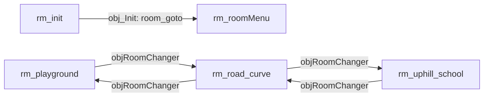

# Комнаты

В проекте 16 комнат: служебная `rm_init`, четыре меню-комнаты, три связанные игровые локации и набор dev/тест-комнат. Фактический порядок комнат задаёт массив `RoomOrderNodes` в `Undefinedtale888.yyp`: он определяет стартовую комнату и последовательность обхода `room_next`/`room_previous`.

## Порядок комнат (Room Order)

Порядок из `RoomOrderNodes` (сверху вниз — от `room_first` к `room_last`):

1. `rm_init`
2. `rm_roomMenu`
3. `rm_playground`
4. `rm_uphill_school`
5. `DevRoom1`
6. `rm_road_curve`
7. `roomForDialogueTesting`
8. `rm_savesSelect`
9. `rm_settings`
10. `rm_devLoad`
11. `rm_cutsceneTest`
12. `SCREENSHOTS`
13. `rm_sound_test`
14. `rm_after_tunnel`
15. `rm_curver`
16. `rm_idk`

Игра стартует в `rm_init` (первая в списке). Порядок также используется dev-навигацией F5/F6: `scr_get_next_game_room()` идёт по `room_next`/`room_previous` и пропускает комнаты, для которых `scr_room_is_dev_navigation_excluded()` возвращает `true`: это `global.__service_menu_rooms` (`rm_roomMenu`, `rm_savesSelect`, `rm_settings`, `rm_devLoad`) плюс `rm_init` и `SCREENSHOTS`.

## Все комнаты

| Комната | Размер | Слой `Instances` | Назначение | Слои (порядок в .yy) |
|---------|--------|:---:|------------|----------------------|
| `rm_init` | 1280×980 | есть | Точка входа: единственный инстанс `obj_Init`, после инициализации `room_goto(rm_roomMenu)` | `Instances`, `Background` |
| `rm_roomMenu` | 1280×960 | есть | Главное меню: `obj_menu` запускает `music_menu` через `global.play_music` | `Assets_1`, `Instances`, `Instances_1`, `Background` |
| `rm_savesSelect` | 1280×960 | есть | Выбор слота сохранения: `obj_saveManager` | `Instances`, `Instances_1`, `Background` |
| `rm_settings` | 1280×960 | есть | Меню настроек: `obj_settingsManager` | `Instances`, `Instances_1` |
| `rm_devLoad` | 320×240 | есть | DEV-LOAD: список комнат для dev-переходов; `obj_devLoader` создаётся из `RoomCreationCode` | `Instances`, `Background` |
| `DevRoom1` | 543×240 | есть | Dev-песочница: `obj_player`, NPC `obj_asher`, тесты `obj_dialoguetest`/`obj_cutsceneTest`/`obj_menuTest` | `Instances_1`, `Instances`, `Assets_2`, `Background` |
| `rm_playground` | 471×320 | есть | Игровая локация: фонари, `obj_kachela`, триггер в `rm_road_curve` | `Assets_1`, `Instances`, `Tiles_3`, `Tiles_4`, `Tiles_2`, `Tiles_1`, `Background` |
| `rm_road_curve` | 500×340 | нет | Игровой хаб: NPC `npc1`/`npc2`, `obj_asher`, `obj_save`, `obj_sign`, `obj_sheepFountain`, два `objRoomChanger` | `collis`, `depth`, `Instances_1`, `tree`, `Tiles_3`–`Tiles_6` (вложенные), `road`, `Assets_1`, `Tiles_1` |
| `rm_uphill_school` | 542×240 | нет | Игровая локация у школы: `obj_player` в комнате, `obj_asher`, скамейки, триггер в `rm_road_curve` | `Tiles_5`, `depth`, `Instances_2`, `colliders`, `Instances_1_1`, `Instances_1`, `tropa`, `grass`, `Tiles_3`, `Assets_1`, `Backgrounds_1` |
| `rm_after_tunnel` | 519×240 | нет | Уровень с дорогой: 14 `obj_visualObject`, коллайдеры и slope-коллайдеры на слое `depth` | `Tiles_1`, `depth`, `road`, `grass`, `Background` |
| `rm_curver` | 540×340 | нет | Черновик уровня: тайлы `path`/`grass`; инстансный слой `Trees` пуст | `Trees`, `path`, `grass`, `Background` |
| `rm_idk` | 320×240 | нет | Черновик с тайлами деревьев: 2 декора (`bush`, `obj_lantern`) на слое `depth` | `depth`, `trees_1_1`, `trees_1`, `trees`, `road`, `grass`, `Background` |
| `rm_cutsceneTest` | 2000×1800 | есть | Тест катсцен: `obj_cutsceneTest`, `obj_player`, `obj_save` | `Instances`, `Tiles_1`, `Background` |
| `roomForDialogueTesting` | 400×320 | есть | Тест диалогов: `textboxTest_scribble` | `Instances`, `Background` |
| `rm_sound_test` | 320×240 | есть | Тест звука: `obj_sound_test` | `Instances`, `Background` |
| `SCREENSHOTS` | 1366×768 | есть | Прогон скриншотов: `screenshot` создаётся из `RoomCreationCode` и очищает папку `screenshots/` при старте | `Instances`, `Background` |

!!! note "Комнаты без слоя `Instances`"
    Пять комнат не имеют слоя с именем `Instances`: `rm_after_tunnel`, `rm_curver`, `rm_idk`, `rm_road_curve`, `rm_uphill_school`. В них инстансы лежат на слоях `depth`, `collis`, `tree`, `Trees`, `Instances_1`/`Instances_2` и т.п. Любой код, создающий инстансы через `scr_layer_ensure_instances()`, в этих комнатах создаст новый слой `Instances` на depth 0.

## Слой `Instances` и `scr_layer_ensure_instances()`

`scr_layer_ensure_instances()` — хелпер для кода, создающего инстансы динамически:

```gml title="scripts/scr_layer_ensure_instances/scr_layer_ensure_instances.gml"
function scr_layer_ensure_instances() {
    if (!layer_exists("Instances")) {
        layer_create(0, "Instances");
    }
    return "Instances";
}
```

- Проверяет наличие слоя по имени через `layer_exists`; если слоя нет, создаёт его на depth `0` через `layer_create`.
- Возвращает строку `"Instances"`, которую вызывающий код передаёт в `instance_create_layer`, поэтому слой создаётся лениво, при первом динамическом спавне.
- Вызывается из создания `obj_cutsceneManager` (`c_begin`, `cutscene_load_json`), диалогового окна `textboxTest_scribble` (`readDialogue`), dev-спавна `obj_player`, маркеров `obj_pointMarker`, менеджеров (`obj_music_ctrl`, `obj_globalManager`, `obj_saveManager`, `obj_settingsManager`, `obj_inGameMenu`) и `RoomCreationCode` комнат `rm_devLoad` и `SCREENSHOTS`.

В комнатах без `Instances` созданный слой окажется на depth `0`: например, в `rm_road_curve` он ляжет позади `Tiles_3` (depth −100), на одной глубине с вложенным `Tiles_6` (depth 0) и перед `road` (depth 300).

## Ключевые инстансы

- **`rm_init`**: `obj_Init` ×1: persistent-инициализатор (см. [Инициализация](initialization.md)).
- **`rm_roomMenu`**: `obj_menu`, `obj_menuBGSpriteChanger`.
- **`rm_savesSelect`**: `obj_saveManager`, `obj_menuBGSpriteChanger`.
- **`rm_settings`**: `obj_settingsManager`, `obj_menuBGSpriteChanger`.
- **`rm_devLoad`**: в .yy инстансов нет; `RoomCreationCode` создаёт `obj_devLoader`.
- **`DevRoom1`**: `obj_player`, `obj_asher` (NPC, `par_interactable`), тестовые триггеры `obj_dialoguetest`/`obj_cutsceneTest`/`obj_menuTest`, декор (`obj_tree2`, `obj_sheepFountain`, `obj_sign`), `obj_collider`, `obj_slopeCollider`.
- **`rm_playground`**: `obj_lantern` ×4, `obj_kachela`, `bush`, `sand`, `obj_tree1`, `objRoomChanger` ×1.
- **`rm_road_curve`**: `obj_tree1` ×24, `obj_collider` ×4, `obj_lantern` ×3, `objRoomChanger` ×2, `npc1`, `npc2` (наследник `npc1`), `obj_asher`, `obj_save`, `obj_sheepFountain`, `obj_sign`.
- **`rm_uphill_school`**: `obj_player`, `obj_asher`, `obj_bench`, `spr_pinkBench`, `obj_lantern` ×3, `obj_tree1` ×3, `obj_collider` ×4, `objRoomChanger` ×1.
- **`rm_after_tunnel`**: `obj_visualObject` ×14, `obj_tree1` ×8, `obj_collider` ×8, `obj_slopeCollider` ×5: чисто геометрия/декор, без интерактива.
- **`rm_idk`**: `bush`, `obj_lantern` (два декора на слое `depth`).
- **`rm_cutsceneTest`**: `obj_cutsceneTest`, `obj_player`, `obj_save`.
- **`roomForDialogueTesting`**: `textboxTest_scribble`.
- **`rm_sound_test`**: `obj_sound_test`.
- **`SCREENSHOTS`**: в .yy инстансов нет; `RoomCreationCode` создаёт `screenshot`.

## Переходы между комнатами

Триггер перехода — `objRoomChanger`. Свойства инстанса в .yy: `room_name` (целевая комната), `x_position`/`y_position` (точка спавна; `-1` по оси = позиция самого триггера), `eyes_glow` (визуальный флаг перехода). При столкновении с `obj_player` снимок свойств пишется в `pending_*`, а в следующем Step создаётся persistent `obj_changingRoomsController`, который выполняет фейд и `room_goto`. Подробности см. в [Переходы между комнатами](../systems/room-transitions.md).

| Комната | Целевая комната | Спавн (x, y) |
|---------|-----------------|--------------|
| `rm_playground` | `rm_road_curve` | 35, 100 |
| `rm_road_curve` | `rm_uphill_school` | 40, 140 |
| `rm_road_curve` | `rm_playground` | 220, 210 |
| `rm_uphill_school` | `rm_road_curve` | 414, 269 |



`rm_init` → `rm_roomMenu` — единственный «жёсткий» переход: `obj_Init` в конце `Create` вызывает `room_goto(rm_roomMenu)`, если текущая комната `rm_init`. Все остальные перемещения идут через `objRoomChanger`, загрузку сейва (`obj_saveManager` → `room_goto(rm_devLoad)` при devload-фокусе) или dev-навигацию F5/F6.

## rm_init: особая комната

`rm_init` не участвует в игровом процессе: единственный инстанс — persistent `obj_Init`, который строит `global.rooms_by_name`, `global.__service_menu_rooms` и остальные глобалы, после чего уводит игру в `rm_roomMenu`. Комната-«тупик»: dev-фильтр `scr_room_is_dev_navigation_excluded` исключает её из F5/F6 и списка DEV-LOAD. Полный разбор см. в [Инициализация](initialization.md).

## См. также

- [Инициализация](initialization.md) — `obj_Init`, `global.rooms_by_name`, `global.__service_menu_rooms`
- [Переходы между комнатами](../systems/room-transitions.md) — `objRoomChanger`, `obj_changingRoomsController`
- [Обзор архитектуры](overview.md) — общая структура проекта

<!-- sources: docs_new/_meta/rooms.txt; Undefinedtale888.yyp:769-786; scripts/scr_layer_ensure_instances/scr_layer_ensure_instances.gml:1-10; scripts/scr_get_next_game_room/scr_get_next_game_room.gml:1-36; objects/objRoomChanger/Collision_obj_player.gml:1-27; objects/objRoomChanger/Step_0.gml:1-26; objects/objRoomChanger/objRoomChanger.yy:31-36; objects/obj_Init/Create_0.gml:181-211,344-354; rooms/rm_playground/rm_playground.yy:25-29; rooms/rm_road_curve/rm_road_curve.yy:51-139; rooms/rm_uphill_school/rm_uphill_school.yy:42-46; rooms/SCREENSHOTS/RoomCreationCode.gml:1-6; rooms/rm_devLoad/RoomCreationCode.gml:1-8; objects/screenshot/Create_0.gml:55-104; objects/obj_menu/Create_0.gml:16-18; objects/obj_saveManager/Step_0.gml:23,156; scripts/scr_global_debug_hotkeys/scr_global_debug_hotkeys.gml:1-54 -->
