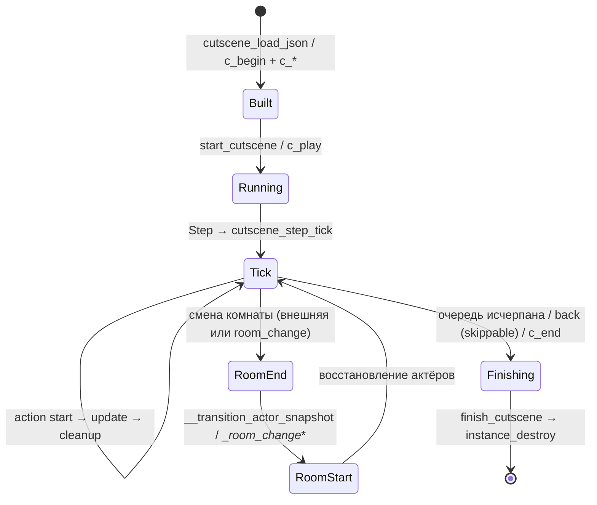

# Архитектура менеджера катсцен

`obj_cutsceneManager` — persistent невизуальный контроллер (без спрайта и родительского объекта). Один инстанс = одна катсцена; `finish_cutscene` завершает сцену и уничтожает менеджер.

## Карта событий

| Событие | Файл | Роль |
|---------|------|------|
| Create | `Create_0.gml` | Поля, пороговые константы, методы диспетчера, `start_cutscene`/`finish_cutscene` |
| Step | `Step_0.gml` | Пропуск по `back`, тик attachments, один вызов `cutscene_step_tick` |
| Draw | `Draw_0.gml` | Мировой debug-оверлей: подписи актёров, пути `FollowPath` |
| Draw GUI | `Draw_64.gml` | Debug-панель очереди, watchdog, превью действий |
| Room Start | `Other_4.gml` | Re-resolve актёров после смены комнаты |
| Room End | `Other_5.gml` | Снапшот актёров, переходный `persistent` |
| Clean Up | `CleanUp_0.gml` | Страховочный `finish_cutscene` при внешнем `instance_destroy`/`game_restart` |

## Create: поля и константы

- **Очередь**: `action_queue`, `current_action_index`, `is_running`, `instant_mode`, идемпотентный гард `__cutscene_finished`.
- **Watchdog**: `debug_current_action_index`, `debug_current_action_elapsed`, `debug_stuck_warning_sent`.
- **Пороги**: `debug_stuck_warning_frames = 600` (кадров до warning о зависшем action), `debug_max_preview = 10` (строк превью очереди), `instant_guard_limit = 1024` (макс. действий за кадр в `instant_mode`), `reached_nodes_limit = 50`.
- **Флаги и реестры**: `skippable = true` по умолчанию; `actor_map` — ключ → инстанс актёра; `actor_specs` — spec для пересоздания при смене комнаты; `dialogue_controller`; `background_actions`; `scheduled_actions`.
- **Настройки**: `cutscene_engine_settings` — кэшированный struct из `cutscene_load_engine_settings()`; из него берутся `debug_enabled` и `debug_extended_log` (пер-файловый `"debug"` в start-action JSON переопределяет оверлей).
- **Контроль и камера**: `partial_control_type`/`partial_control_whitelist`/`partial_control_allowed_actions`; `prev_cutscene_camera_override`, `prev_camera_view_x/y`, `prev_player_can_move`.
- **Служебное**: `__goto_back_jumps` — счётчик обратных переходов `ActionGoToNode`; ленивая инициализация `global.__cutscene_attachments` и `global.__cutscene_checkpoints`.

## Step: один тик диспетчера

`Step_0` в порядке: выход при `!is_running` → пропуск (`skippable && scr_input_pressed("back")` → `finish_cutscene`) → `frame_counter++` → `__cutscene_update_attachments()` → `cutscene_step_tick()`.

`cutscene_step_tick` (метод из Create) обрабатывает три потока:

1. **`background_actions`** — фоновые действия параллельно сюжету; каждое проходит `start` → `update` → `cleanup` и удаляется по `done`.
2. **`scheduled_actions`** — fire-and-forget inner-действия из `ActionScheduleAction` (non-blocking `schedule_action`).
3. **Основная очередь** — текущий action: `start` один раз (флаг `started`), `update` до возврата `true`, `cleanup` один раз (флаг `__cleanup_done`), `current_action_index++`. Не-struct записи пропускаются со сбросом watchdog-счётчика. В `instant_mode` цикл продолжается до `instant_guard_limit` действий за кадр — срабатывание гарда логирует warning.

Каждая фаза проверяет `__cutscene_finished`: `start`/`update`/`cleanup` могут реентерабельно вызвать `finish_cutscene`, и тик обязан прерваться, не диспетча на завершённом менеджере.

Параллельно менеджеру в `obj_globalManager/Step_0` каждый кадр работает `cutscene_runtime_step()` — отдельный рантайм эффектов (tween/fade/jump/spin/shake) с полем `owner_id`. `finish_cutscene` гасит свои эффекты через `cutscene_runtime_cleanup_owner(id)`.

## start_cutscene

- Сбрасывает состояние прошлого прогона: `__cutscene_finished = false`, `__parallel_stack = []`, `__goto_back_jumps = 0`, watchdog.
- Завершает предыдущую активную катсцену через её `finish_cutscene` и закрывает протёкший build-менеджер `global.__cutscene_build_mgr`.
- Занимает глобалы: `global.active_cutscene_manager = id`, `active_cutscene_id`, `cutscene_active = true`; чистит протухшие attach-записи чужих менеджеров.
- Игрок: при `partial_control_type == 0` ставит `can_move = false` и гасит walk-кадр (`image_speed`/`image_index`), иначе при частичном контроле движение не трогает.
- Камера: запоминает `cutscene_camera_override` и view-позицию, взводит `global.cutscene_camera_override = true`.

## finish_cutscene — что сбрасывает

Идемпотентный (`__cutscene_finished` выставляется до любой чужой логики), три региона:

1. **Глобалы** — только при отсутствии чужой активной катсцены (гард владения): `active_cutscene_id`/`active_cutscene_manager`/`cutscene_active`; поля `partial_control_*` в дефолт; `player.can_move` из `prev_player_can_move` (только при типе 0); `depth_mode = "auto"` у игрока; `global.__actor_forced_emotion = {}`; `cutscene_camera_override` назад и рецентр камеры на игрока либо на `prev_camera_view_*`; `global.unduck_music(0)` под try/catch; `global.__cutscene_checkpoints = {}`; `global.music_persist_track = noone`.
2. **Cleanup действий** — контракт: `cleanup()` вызывается только у `started == true` и один раз (`__cleanup_done`), каждый вызов в try/catch. Порядок: текущий action → оставшиеся в `action_queue` → `background_actions` → `cutscene_runtime_cleanup_owner(id)` → `scheduled_actions` → снятие attach-связей (`attached_target = noone`, записи с `detach_on_cutscene_end` удаляются).
3. **Уничтожение** — актёры из `actor_map`, кроме `obj_player` и `persistent`-спавнов (оба пропуска логируются); `depth_mode` возвращается в `"auto"`; attach-записи с мёртвыми ссылками дочищаются; `actor_map`/`actor_specs` очищаются; `dialogue_controller` уничтожается; `instance_destroy()`.

## skippable

`skippable` по умолчанию `true`; JSON перекрывает его полем `settings.skippable` в `cutscene_load_json`. В `Step_0` нажатие `back` (`scr_input_pressed("back")`) вызывает `finish_cutscene` — сцена проходит полный cleanup регионов 1–3, а не «отматывается». Сюжетные катсцены ставят `"skippable": false`.

## goto и `__goto_back_jumps`

`ActionGoToNode` переносит `current_action_index` на метку `mark_node` в основной очереди — метки внутри `parallel`/`sequence` недостижимы (warning). Прыжок вперёд пропускает действия; назад — сбрасывает `started`/`__cleanup_done`/числовые таймеры и вызывает `reset()` у переигрываемых. Самопрыжок — no-op с warning. Обратные прыжки считает `__goto_back_jumps`: за лимитом 1024 переход отменяется с warning «вероятный бесконечный цикл» — защита от схем «goto → goto», вешающих игру.

`__parallel_stack` — стек активных `ActionParallel`: push/pop при обходе веток, `insert_actions` изнутри параллельной ветки вставляет продолжение в саму ветку (`__cutscene_parallel_splice`), `__cutscene_parallel_request_abort` помечает верхнюю группу на досрочное завершение. Сбрасывается в `start_cutscene` и первой строкой `finish_cutscene`.

## Переход комнаты внутри катсцены

Менеджер `persistent` — переживает `room_goto` вместе с очередью. Сценария два:

- **`ActionRoomChange`** (JSON `room_change`): `start` пишет в менеджер `__room_change_target_room`, `__room_change_player_x/y`, `__room_change_actor_positions`, взводит `__room_change_in_progress` и создаёт `obj_changingRoomsController` с фейдом (`__player_pos_by_manager` отключает дублирующую запись позиции игрока в `scr_room_fade_update`). `update` ждёт смерти контроллера; если тот завершился без перехода — параметры инвалидируются с warning.
- **Внешний переход** (`objRoomChanger`/`room_goto` игроком): катсцена не обрывается — актёры восстанавливаются по снапшоту.

`Other_5` (Room End) до разборки комнаты пишет `__transition_actor_snapshot`: для каждого живого актёра `{x, y, was_persistent, persist_marked}`. Актёры со spec получают временный `persistent = true` — переживают переход физически и сохраняют идентичность/привязки; комнатные NPC без spec не помечаются (иначе чужой контент навсегда переехал бы в новую комнату).

`Other_4` (Room Start) безусловно обнуляет `dialogue_controller` (не persistent), затем:

- внешний переход (`is_running`, без `__room_change_in_progress`): пережившим возвращает `persistent = was_persistent`, погибших со spec пересоздаёт `__cutscene_respawn_actor` на снятой позиции, безвозвратных удаляет из `actor_map`/`actor_specs` с warning — зависимые действия отработают как target-not-found, очередь не виснет;
- `ActionRoomChange`: ставит игрока в `player_x/y`, живых актёров перемещает в `actor_positions`, мёртвых пересоздаёт по spec, снимает переходный `persistent`, очищает снапшот и все `__room_change_*` поля.

## Музыка: snapshot/restore и persist

`checkpoint_state` с `include_music` снимает в snapshot секцию `music`: `current_track` (`global.music_current`), `volume`, `pitch`, `paused`, `duck_multiplier`, `layered_mode`, `layer2_asset`, `layer_intensity`, `persist_track`.

`restore_state` через `__cutscene_restore_music_state` возвращает: `music_current` (только валидный asset id), `music_volume`, перезапуск трека `play_music_immediate`, layered-слои поверх живого трека (`play_music_layered` + `set_music_layer_intensity`), `set_music_pitch`, `duck_music`, `music_persist_track`, `set_music_volume_fade`, `pause_music`.

На финале `finish_cutscene` снимает `global.music_persist_track` — следующая смена комнаты снова выберет трек комнаты (`scr_global_on_room_change`), — и вызывает `global.unduck_music(0)`, если сцена не успела unduck.

## Настройки движка

`cutscene_load_engine_settings()` — кэшированный read-only struct (`static`, сброс через `_force_reload`) из `cutscenes/cutscene_engine_settings.json`; при отсутствии файла или ошибке разбора — дефолты `__cutscene_default_engine_settings()`: `default_fps = 60` (валидируется в диапазоне 1–240), `default_actor_object`, `default_emote_sprite`, `whitelist.run_functions`/`branch_conditions` (advisory-проверки фабрики), `debug.enable_extended_log`/`show_overlay`. Схема полей — в [форматах данных](../architecture/data-formats.md).

## Ошибки и watchdog

- **Загрузка**: `cutscene_load_json` логирует `[CUTSCENE] ОШИБКА` (пустой путь, файл не найден, битый UTF-8/JSON, корень не объект, нет `actions`) и возвращает `noone`, уничтожая недособранный менеджер.
- **Фабрика и действия**: неизвестный `type`, невалидный `mode`, нерезолвенный `target` → `WARNING` + пропуск действия — очередь продолжается, `update` без ресурсов завершается штатно.
- **Stuck-watchdog**: action длиннее `debug_stuck_warning_frames` (600 кадров) → одноразовый warning с `action_type` и `cutscene_id`; пишется при `debug_enabled` или `debug_extended_log`, катсцену не останавливает.
- **Завершение сломанной сцены**: `finish_cutscene` вызывается естественно (конец очереди), пропуском `back`, `c_end()`/`cutscene_stop_active()` или через `CleanUp_0` при внешнем `instance_destroy`/`game_restart`. Ошибки в `cleanup` гасятся try/catch; глобалы восстанавливаются до чужого кода — игра не попадает в softlock (ввод, камера, duck музыки).

## Жизненный цикл

## См. также

- [Обзор катсцен](overview.md) — способы задать сцену, глобалы, быстрый старт
- [JSON-действия](json-actions.md) — типы `actions[]` и их поля
- [Action-классы](action-classes.md) — контракт `CutsceneAction`, `start`/`update`/`cleanup`
- [Частичный контроль](partial-control.md) — `control_type` 0/1/2, `allowed_actions`
- [Актёры и камера](actors-and-camera.md) — `actor_map`, `resolve_target`, camera-действия
- [Переходы комнат](../systems/room-transitions.md) — `obj_changingRoomsController`, `scr_room_fade_update`
- [Музыка](../systems/music.md) — `obj_music_ctrl`, `music_persist_track`, duck
- [Форматы данных](../architecture/data-formats.md) — схема JSON и `cutscene_engine_settings.json`

<!-- sources: objects/obj_cutsceneManager/Create_0.gml:1-934; objects/obj_cutsceneManager/Step_0.gml:1-26; objects/obj_cutsceneManager/Other_4.gml:1-161; objects/obj_cutsceneManager/Other_5.gml:1-29; objects/obj_cutsceneManager/CleanUp_0.gml:1-21; objects/obj_cutsceneManager/obj_cutsceneManager.yy; objects/obj_globalManager/Step_0.gml:49; scripts/scr_cutscene_classes/scr_cutscene_classes.gml:139-234,733-1073,1442-1516,1767-1870,4183-4230,4712-4805,4807-4820; scripts/scr_cutscene_music/scr_cutscene_music.gml:25-54; scripts/cutscene_load_json/cutscene_load_json.gml:7-191; scripts/cutscene_load_engine_settings/cutscene_load_engine_settings.gml:12-180; scripts/cutscene_action_factory/cutscene_action_factory.gml:1200-1240; scripts/scr_global_on_room_change/scr_global_on_room_change.gml:33-43 -->
