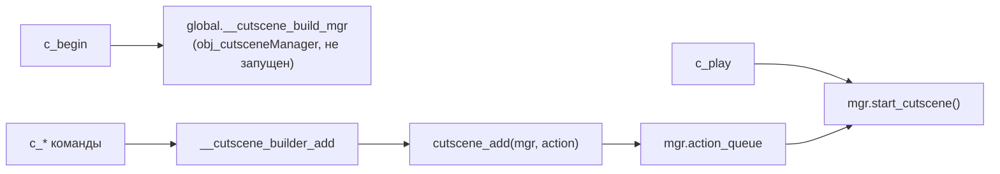

# GML DSL катсцен

Императивный слой поверх очереди действий: функции `c_*` собирают `Action*`-struct'ы в очередь менеджера катсцен между `c_begin()` и `c_play()`, а `cutscene_*`-хелперы создают действия напрямую или управляют загрузкой. Те же команды доступны из Yarn-скриптов через `ChatterboxAddFunction`.

## Как устроена сборка



- `c_begin(_id)` создаёт `obj_cutsceneManager` и кладёт его в `global.__cutscene_build_mgr` («слот сборки»).
- Каждая `c_*`-команда конструирует Action-struct и передаёт его в `__cutscene_builder_add` (`scripts/c_cmd/c_cmd.gml`), который резолвит менеджер: сначала `global.active_cutscene_manager`, иначе `global.__cutscene_build_mgr`. Поэтому вызовы `c_*` во время играющей катсцены **инъецируют действия в её живую очередь**, а не в новую сцену.
- `c_play(_mgr)` вызывает `start_cutscene()` у найденного менеджера и очищает build-слот.
- `c_end(_mgr)` закрывает сессию с приоритетом целей: явный менеджер → build-менеджер (отмена недособранной сцены) → активная катсцена (`finish_cutscene()`).

Единицы: длительности задаются в кадрах, скорости в px/кадр (в отличие от JSON-DSL, где секунды и px/sec).

Аргумент `_target` везде одинаков: строковый ключ актёра, object index или instance id; резолвится в рантайме через менеджер. У команд с обязательным target пустой/`undefined` target отклоняет действие и пишет `[CUTSCENE] ПРЕДУПРЕЖДЕНИЕ` в консоль (`__cutscene_cmd_require_target`). Исключения: `c_halt`, `c_shakeobj` и одноаргументные формы `c_flip`/`c_visible`: они всё равно ставят действие в очередь через `__cutscene_selected_actor()` (тоже с предупреждением), но с пустым target `""`, который в рантайме резолвится в `noone`.

!!! warning "Вызов вне сессии"
    Если нет ни активной катсцены, ни build-менеджера, `__cutscene_builder_add` молча возвращает `noone`, и команда просто теряется. Всегда оборачивайте последовательность в `c_begin`/`c_play` (или вызывайте из идущей катсцены/диалога).

## Живые `c_*`-команды

Большинство команд определено в `scripts/c_cmd/c_cmd.gml`; `c_begin`, `c_play`, `c_end`, `c_wait`, `c_speaker`, `c_facing`, `c_setxy`, `c_depth`, `c_autofacing` и `c_autowalk` лежат в одноимённых `scripts/c_*/*.gml`.

| Команда | Сигнатура | Что добавляет в очередь |
|---------|-----------|--------------------------|
| `c_begin` | `c_begin(_id = "")` | Не действие: создаёт build-менеджер, возвращает его |
| `c_play` | `c_play(_mgr = noone)` | Не действие: `start_cutscene()` у build/явного менеджера |
| `c_end` | `c_end(_mgr = noone)` | Не действие: завершает сессию сборки или активную катсцену |
| `c_wait` | `c_wait(_frames)` | `ActionWait` |
| `c_waittalk` | `c_waittalk()` | `ActionWaitForDialogue`: ждать конца текущего диалога |
| `c_speaker` | `c_speaker(_speaker_name)` | `ActionRunFunction`: пишет имя в `display_name_prev` окна диалога |
| `c_dialogue` | `c_dialogue(_file, _node = undefined)` | `ActionDialogue` |
| `c_setxy` | `c_setxy(_target, _x, _y)` | `ActionSetXY`: мгновенный телепорт |
| `c_depth` | `c_depth(_target, _depth)` | `ActionSetDepth`: глубина + `depth_mode = "manual"` |
| `c_facing` | `c_facing(_target, _dir)` | `ActionSetFacing` (через `cutscene_set_facing`) |
| `c_autofacing` | `c_autofacing(_target, _enabled)` | `ActionSetProperty` по `auto_face` |
| `c_autowalk` | `c_autowalk(_target, _enabled)` | `ActionSetProperty` по `auto_walk` |
| `c_animate` | `c_animate(_target, _sprite, _image_index = undefined, _image_speed = undefined)` | `ActionAnimate` |
| `c_sprite` | `c_sprite(_target, _sprite, _image_index = undefined, _image_speed = undefined)` | `ActionAnimate` (алиас `c_animate`) |
| `c_walk` | `c_walk(_target, _dir, _speed, _frames, _use_collision = undefined)` | `ActionMoveRelativeDirection` |
| `c_walkdirect` | `c_walkdirect(_target, _x, _y, _frames, _use_collision = undefined)` | `ActionMoveDirect` в режиме «за N кадров» |
| `c_walkdirect_speed` | `c_walkdirect_speed(_target, _x, _y, _speed, _use_collision = undefined)` | `ActionMoveDirect` в режиме «со скоростью» |
| `c_tween` | `c_tween(_target, _property, _to_value, _frames, _easing = undefined, _from_value = undefined, _kind = "instance")` | `ActionTween` |
| `c_tween_camera` | `c_tween_camera(_property, _to_value, _frames, _easing = undefined, _from_value = undefined)` | `ActionTween` с `kind = "camera"` (target не нужен) |
| `c_fadein` | `c_fadein(_frames, _color = undefined)` | `ActionFadeIn` |
| `c_fadeout` | `c_fadeout(_frames, _color = undefined)` | `ActionFadeOut` |
| `c_sfx` | `c_sfx(_sound_or_key, _volume = undefined, _pitch = undefined)` | `ActionPlaySFX` |
| `c_soundplay` | `c_soundplay(_sound_or_key, _volume = undefined, _pitch = undefined)` | алиас `c_sfx` |
| `c_emote` | `c_emote(_target, _sprite = undefined, _frames = undefined, _offset_x = undefined, _offset_y = undefined, _scale = undefined)` | `ActionEmote` |
| `c_jump` | `c_jump(_target, _x, _y, _frames, _height = undefined, _easing = undefined)` | `ActionJump` |
| `c_halt` | `c_halt(_target = undefined)` | `ActionHalt`: остановить движение актёра |
| `c_flip` | `c_flip(_target, _flipped = undefined)` | `ActionFlip`: `image_xscale` |
| `c_spin` | `c_spin(_target, _speed, _frames = undefined)` | `ActionSpin` |
| `c_shakeobj` | `c_shakeobj(_target = undefined, _frames = undefined, _magnitude = undefined)` | `ActionShakeObject` |
| `c_visible` | `c_visible(_target, _visible = undefined)` | `ActionSetProperty` по `visible` |
| `c_instant` | `c_instant(_enabled = undefined)` | `ActionSetInstantMode` |
| `c_var_instance` | `c_var_instance(_target, _property, _value)` | `ActionSetProperty` |
| `c_var_lerp_instance` | `c_var_lerp_instance(_target, _property, _from, _to, _frames, _easing = undefined)` | `ActionTween` с явным `from` |
| `c_var_lerp_to_instance` | `c_var_lerp_to_instance(_target, _property, _to, _frames, _easing = undefined)` | `ActionTween` от текущего значения свойства |
| `c_lerp` | `c_lerp(_target, _property, _from, _to, _frames, _easing = undefined)` | алиас `c_var_lerp_instance` |
| `c_play_json` | `c_play_json(_path)` | Не действие: вызывает `cutscene_play_json` (загрузить JSON-катсцену и запустить) |

Значения по умолчанию для опциональных аргументов заданы только в конструкторах `Action*`: `c_*`-слой передаёт `undefined`, не дублируя числа.

## Заглушки `DELETE_CANDIDATE`

Девять `c_*`-команд зачищены до пустых тел (`0` вызовов в проекте, не зарегистрированы в Chatterbox, не встречаются в `datafiles`). Ресурсы сохранены как «safe as stub» до решения об удалении. **Вызывать их бессмысленно, они ничего не делают**:

| Команда | Файл | Сигнатура-заглушка |
|---------|------|--------------------|
| `c_cmd_x` | `scripts/c_cmd_x` | `c_cmd_x(arg0..arg6)`: вызывалась только из `c_delaycmd`/`c_delaywalk` |
| `c_delaycmd` | `scripts/c_delaycmd` | `c_delaycmd(_target, _delay_frames, _inner_cmd, _arg0)` |
| `c_delaywalk` | `scripts/c_delaywalk` | `c_delaywalk(_target, _delay_frames, _dir, _speed, _frames)` |
| `c_instance` | `scripts/c_instance` | `c_instance(_key, _x, _y)` |
| `c_pan` | `scripts/c_pan` | `c_pan(_x, _y, _frames)`: вызывалась только из `c_pan_wait` |
| `c_panobj` | `scripts/c_panobj` | `c_panobj(_target, _frames)` |
| `c_panspeed` | `scripts/c_panspeed` | `c_panspeed(_x, _y, _frames)` |
| `c_pan_wait` | `scripts/c_pan_wait` | `c_pan_wait(arg0, arg1, arg2)` |
| `c_shake` | `scripts/c_shake` | `c_shake(_frames = undefined, _magnitude = undefined)` |

Имен `c_move`, `c_follow_path`, `c_actor_create`, `c_parallel`, `c_branch`, `c_camera_*` в проекте нет: для камеры, ветвлений и параллели используйте JSON-действия или `Action*`-классы напрямую.

## Хелперы `cutscene_*`

| Функция | Сигнатура | Что делает |
|---------|-----------|------------|
| `cutscene_add` | `cutscene_add(_mgr, _action)` | Кладёт Action-struct в `_mgr.action_queue`, гарантирует `started = false`; reject-пути логируются только при `global.debug` |
| `cutscene_branch` | `cutscene_branch(_condition_func, _true_actions, _false_actions = [])` | Возвращает `ActionBranch` |
| `cutscene_set_facing` | `cutscene_set_facing(_target_ref, _direction)` | Возвращает `ActionSetFacing` (принимает `global.DIR.*` или строку `"left"` и т.п.) |
| `cutscene_load_json` | `cutscene_load_json(_path)` | Читает JSON-файл (buffer_load, срез BOM, `json_parse`), создаёт менеджер без запуска; `noone` при ошибке. Префиксы `./` и `datafiles/` срезаются |
| `cutscene_play_json` | `cutscene_play_json(_path)` | `cutscene_load_json` + `start_cutscene()`; возвращает менеджер |
| `cutscene_stop_active` | `cutscene_stop_active()` | `finish_cutscene()` активного менеджера; возвращает `bool` |
| `cutscene_is_active` | `cutscene_is_active()` | Возвращает `global.cutscene_active` |
| `cutscene_dialogue_is_active` | `cutscene_dialogue_is_active()` | Идёт ли диалог внутри катсцены |
| `cutscene_load_engine_settings` | `cutscene_load_engine_settings(_force_reload = false)` | Кэшированный (static) struct настроек из `cutscenes/cutscene_engine_settings.json`; контракт «только чтение» |
| `cutscene_init_action_factory` | `cutscene_init_action_factory()` | Лениво строит `global.__cutscene_action_factory`: таблицу `f[$ "type"]` для JSON-действий |
| `cutscene_register_chatterbox_functions` | `cutscene_register_chatterbox_functions()` | Одноразовая регистрация команд в Chatterbox (см. ниже) |
| `cutscene_music_pitch` | `cutscene_music_pitch(_pitch)` | Возвращает `ActionMusicPitch` |
| `cutscene_music_pause` | `cutscene_music_pause()` | Возвращает `ActionMusicPause` |
| `cutscene_music_resume` | `cutscene_music_resume()` | Возвращает `ActionMusicResume` |

### Заглушки `cutscene_*`

Слой обёрток «одна функция — один Action» зачищён (`DELETE_CANDIDATE`, живые маршруты создают `Action*` напрямую):

- Отдельные файлы (17): `cutscene_actor_create`, `cutscene_actor_destroy`, `cutscene_animate`, `cutscene_auto_facing_toggle`, `cutscene_auto_walk_toggle`, `cutscene_camera_center`, `cutscene_camera_pan`, `cutscene_camera_shake`, `cutscene_camera_track`, `cutscene_dialogue`, `cutscene_follow_path`, `cutscene_move`, `cutscene_parallel`, `cutscene_run_function`, `cutscene_set_depth`, `cutscene_set_xy`, `cutscene_wait`.
- Внутри `scripts/cutscene_add/cutscene_add.gml` (14): `cutscene_tween`, `cutscene_fade_in`, `cutscene_fade_out`, `cutscene_play_sfx`, `cutscene_emote`, `cutscene_jump`, `cutscene_halt`, `cutscene_flip`, `cutscene_spin`, `cutscene_shake_object`, `cutscene_set_visible`, `cutscene_set_instant`, `cutscene_wait_for_dialogue`, `cutscene_set_property`.
- `scr_cutscene_make()` — заглушка, всегда возвращает `noone`. Не использовать: менеджер создают `c_begin()` и `cutscene_load_json()`.
- `scr_cutscene_animate` (`Script312`) — пустой стаб, имя функции не совпадает с ресурсом; живой аналог: `c_animate`/`ActionAnimate`.

## Регистрация в Chatterbox

`cutscene_register_chatterbox_functions()` (в `scripts/c_cmd/c_cmd.gml`) вызывается один раз из `obj_Init/Create_0.gml` после `global.__cutscene_chatterbox_registered = false`; повторный вызов сразу возвращает `true`. Каждое имя регистрируется через `ChatterboxAddFunction` и доступно в Yarn как `<<имя(...)>>`.

Доступные в Yarn имена:

- Жизненный цикл: `c_begin`, `c_play`, `c_play_json`, `c_end`, `c_wait`, `c_waittalk`, `c_speaker`, `c_dialogue`.
- Актёры: `c_walk`, `c_walkdirect`, `c_walkdirect_speed`, `c_setxy`, `c_depth`, `c_facing`, `c_autofacing`, `c_autowalk`, `c_animate`, `c_sprite`, `c_emote`, `c_jump`, `c_halt`, `c_flip`, `c_spin`, `c_shakeobj`, `c_visible`, `c_instant`.
- Свойства: `c_tween`, `c_tween_camera`, `c_var`, `c_var_instance`, `c_var_lerp`, `c_var_lerp_instance`, `c_var_lerp_to`, `c_var_lerp_to_instance`, `c_lerp` (`c_var`/`c_var_lerp`/`c_var_lerp_to`: только yarn-алиасы, GML-функций с такими именами нет).
- Экран и звук: `c_fadein`, `c_fadeout`, `c_sfx`, `c_soundplay`.
- Управление: `cutscene_play_json`, `cutscene_stop_active`, `cutscene_is_active`, `cutscene_dialogue_is_active`.

Аргументы из Chatterbox приходят строками: обёртки конвертируют их через `__cutscene_bridge_real` (обязательные числа, мусор → `0`), `__cutscene_bridge_real_opt` (опциональные, «не задано» → `undefined` → дефолт конструктора Action) и `__cutscene_bridge_color` (имена `black`/`white`/`red`/`green`/`blue`/`yellow` или число).

## Примеры

```gml title="Сборка катсцены из GML"
var _mgr = c_begin("intro_scene");     // obj_cutsceneManager в build-слоте
c_setxy("npc_guard", 320, 240);        // ActionSetXY → очередь _mgr
c_facing("npc_guard", "down");         // ActionSetFacing
c_emote("npc_guard");                  // ActionEmote (спрайт по умолчанию)
c_sfx("snd_wobble");                   // ActionPlaySFX
c_wait(30);                            // ActionWait — полсекунды при 60 fps
c_play(_mgr);                          // start_cutscene() — очередь исполняется
```

```yarn title="datafiles/Dialogues/testDialogue.yarn — нода Cutscene-Bridge-Demo"
<<c_begin("dialogue_bridge_demo")>>
<<c_soundplay("confirm")>>
<<c_var("player", "image_alpha", 0.4)>>
<<c_var_lerp_to("player", "image_alpha", 1, 80, "ease_in")>>
<<c_emote("player")>>
<<c_play()>>
```

!!! note "Диалог вне катсцены"
    Та же последовательность `<<c_begin>>…<<c_play>>` в обычной yarn-ноде собирает и запускает standalone-катсцену: команды расширяют очередь любого текущего менеджера (build или активного).

## См. также

- [Обзор катсцен](overview.md): жизненный цикл, `obj_cutsceneManager`, `action_queue`
- [Классы действий](action-classes.md): сигнатуры `Action*`-конструкторов
- [JSON-действия](json-actions.md): декларативный формат, `partial_control`, `parallel`
- [Частичный контроль](partial-control.md): `partial_control_type`, whitelist ввода
- [Диалоги](../systems/dialogue.md): `readDialogue`, `textboxTest_scribble`, Chatterbox
- [Ввод](../systems/input.md): `scr_input_*`, виртуальный ввод во время катсцены

<!-- sources: scripts/c_cmd/c_cmd.gml:1-349; scripts/c_begin/c_begin.gml; scripts/c_play/c_play.gml; scripts/c_end/c_end.gml; scripts/c_wait/c_wait.gml; scripts/c_speaker/c_speaker.gml; scripts/c_facing/c_facing.gml; scripts/c_setxy/c_setxy.gml; scripts/c_depth/c_depth.gml; scripts/c_autofacing/c_autofacing.gml; scripts/c_autowalk/c_autowalk.gml; scripts/c_cmd_x/c_cmd_x.gml; scripts/c_delaycmd/c_delaycmd.gml; scripts/c_delaywalk/c_delaywalk.gml; scripts/c_instance/c_instance.gml; scripts/c_pan/c_pan.gml; scripts/c_panobj/c_panobj.gml; scripts/c_panspeed/c_panspeed.gml; scripts/c_pan_wait/c_pan_wait.gml; scripts/c_shake/c_shake.gml; scripts/cutscene_add/cutscene_add.gml:1-45; scripts/cutscene_branch/cutscene_branch.gml; scripts/cutscene_set_facing/cutscene_set_facing.gml; scripts/cutscene_load_json/cutscene_load_json.gml:1-100; scripts/cutscene_load_engine_settings/cutscene_load_engine_settings.gml:1-44; scripts/cutscene_action_factory/cutscene_action_factory.gml:1-73; scripts/scr_cutscene_make/scr_cutscene_make.gml; scripts/scr_cutscene_animate/scr_cutscene_animate.gml; scripts/scr_cutscene_music/scr_cutscene_music.gml:156-178; objects/obj_Init/Create_0.gml:268-270; objects/obj_cutsceneManager/Create_0.gml:585-665; datafiles/Dialogues/testDialogue.yarn:33-38; audit_2026-09/fix/DELETE_CANDIDATES.md -->
