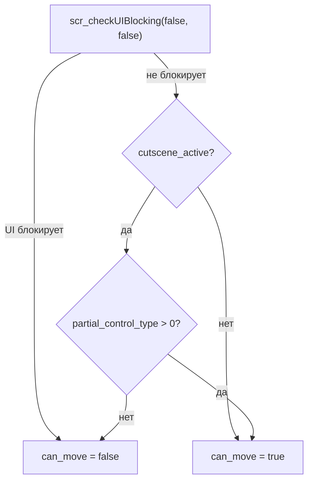

# Частичный контроль

Режим `partial_control` разрешает игроку часть ввода во время играющей катсцены, не завершая её. Состояние хранится в трёх полях менеджера (`partial_control_type`, `partial_control_whitelist`, `partial_control_allowed_actions`), переключается действием `ActionPartialControl` и применяется двумя фильтрами: ввод фильтрует `scr_inputApi`, выбор объектов фильтрует `scr_interaction`.

## Режимы `partial_control_type`

Enum `INTERACT_PARTIAL_CONTROL` объявлен в `scripts/interactionWithNPCsOrObjects/interactionWithNPCsOrObjects.gml`; значения — часть контракта с `ActionPartialControl` и JSON-фабрикой:

| Значение | Константа | Движение | Взаимодействие | Ввод |
|----------|-----------|----------|----------------|------|
| `0` | `LOCKED` | заблокировано (`can_move = false`) | запрещено | весь не-UI ввод подменяется виртуальным |
| `1` | `WHITELIST` | заблокировано, пока `move` не в `allowed_actions` | только объекты из `whitelist` | проходят действия из `allowed_actions` |
| `2` | `FREE` | разрешено | любое | весь ввод проходит, катсцена в фоне |

`ActionPartialControl.start` пишет три поля менеджера и сразу выставляет `obj_player.can_move`: `false` при `control_type == 0`, `true` при `> 0`. Начальный фриз при `start_cutscene()` тоже зависит от типа: `can_move` гасится только при `partial_control_type == 0`. `finish_cutscene()` сбрасывает все три поля и восстанавливает `can_move` из `prev_player_can_move` (только если тип был `0`).

!!! warning "Мусорный `control_type`"
    Значения вне `0/1/2` трактуются как «заблокировано»: `scr_input__is_cutscene_blocked_here` пишет `[INPUT] WARNING: неизвестный partial_control_type=...` один раз (флаг `__partial_control_warned` на менеджере) и продолжает глушить ввод. Тот же дефолт «запрет» действует и в `scr_interaction`.

## `allowed_actions` и алиасы

`partial_control_allowed_actions` — массив строк, который проверяет `scr_input__partial_control_allows(_mgr, _action)` в WHITELIST-режиме:

- `"move"`: алиас группы `up`, `down`, `left`, `right`, `run`;
- `"interact"`: алиас `confirm`;
- любая другая строка сравнивается с именем действия из `input_map` напрямую (`confirm`, `back`, `menu`, `delete` и т.д., полный список: `scr_input_actions_list`);
- пустой массив даёт узкий дефолт: только `confirm`.

`partial_control_whitelist` — массив ключей/имён объектов, которые можно активировать в WHITELIST-режиме. Фильтр применяет `scr_interaction`: каждый элемент резолвится через `mgr.resolve_target()` и сравнивается с `id` инстанса; вне списка взаимодействие отклоняется.

## Как глушится ввод

`scr_input__is_cutscene_blocked_here(_action)` — единый гейт, который вызывают `scr_input_down`, `scr_input_pressed` и `scr_input_repeater`. Порядок проверок:

1. `global.cutscene_active == false` → ввод свободен.
2. UI-объекты (`scr_ui_objects_list()`, тот же список, что у `scr_checkUIBlocking`, плюс `obj_cutsceneManager` и `obj_sound_test`) → всегда читают реальный ввод, даже в катсцене.
3. `partial_control_type == FREE` → ввод свободен.
4. `partial_control_type == WHITELIST` → `scr_input__partial_control_allows`; не разрешённое действие блокируется.
5. `LOCKED` и любые прочие значения → блокировка.

Заблокированный ввод не пропадает: он подменяется виртуальным: `scr_input_down/pressed` читают `__cutscene_virtual_down` / `__cutscene_virtual_prev` на инстансе (продюсеров виртуального ввода нет, фактически возвращается `false`).

Отдельный фильтр: `scr_player_ui_blocking()` (вызывается в `obj_player/Step_0` до `scr_player_movement`):



UI-блокировка проверяется первой и с `include_cutscene = false`: открытое меню/диалог глушит движение даже в `FREE`-режиме; ветка `partial_control` срабатывает только когда UI не блокирует.

## `wait_for_interact` и риск софтлока

`ActionWaitForInteract` (`"type": "wait_for_interact"` в JSON) ждёт, пока игрок активирует конкретный объект: `scr_interaction`/`obj_save` при успешном взаимодействии пушат `id` инстанса в очередь `global.__interacted_targets` (максимум 32 записи), а действие ищет в ней свой `resolved_target` и удаляет запись при совпадении. Очередь-вместо-флага позволяет нескольким `wait_for_interact` в `parallel`-ветках ждать разные цели.

Связанные механизмы против зависания:

- **Пустой `allowed_actions` → только `confirm`.** Именно этот дефолт держит связку `partial_control type 1` + `wait_for_interact` рабочей: если бы whitelist-режим глушил `confirm`, очередь `__interacted_targets` никогда не пополнялась бы и ожидание с `timeout: 0` висело бы бесконечно (софтлок).
- **`timeout` (секунды в JSON, конвертируется в кадры)**: при `0` ждёт бесконечно; при истечении `timeout_action` решает: `"continue"` (по умолчанию) или `"abort_parallel"` (оборвать соседние ветки `parallel` через `__cutscene_parallel_request_abort`).
- **Перерезолв цели.** `update()` при мёртвом `resolved_target` резолвит ключ заново: актёр мог быть пересоздан (`room_change`/`actor_destroy` + `spawn_entity`), и замороженный `id` никогда не совпал бы с элементом очереди.
- **Чистка очереди.** Мёртвые `id` выметаются на каждом проходе `update()` и в `cleanup()`: после смены комнаты их никто не снимает.

!!! danger "Софтлок без confirm"
    `wait_for_interact` с `timeout: 0` под `partial_control` без `confirm`/`interact` в `allowed_actions` (или без `partial_control` вообще) даёт гарантированное зависание: ввод игрока глушится, очередь не пополняется. Указывайте `timeout` или включайте `confirm` в `allowed_actions`.

## JSON-поля действия `partial_control`

| Поле | Тип | По умолчанию | Описание |
|------|-----|--------------|----------|
| `control_type` | `real` | `0` | `0`/`1`/`2`: `LOCKED`/`WHITELIST`/`FREE` |
| `whitelist` | `array` строк | `[]` | Ключи/имена объектов, разрешённых для взаимодействия (не-строки отбрасываются) |
| `allowed_actions` | `array` строк или строка | `[]` | Действия ввода; принимается также JSON-строка `"[\"move\"]"` или `"move,interact"` |

```json title="partial_control + wait_for_interact"
{ "type": "partial_control", "control_type": 1, "whitelist": ["obj_terminal"], "allowed_actions": ["interact"] },
{ "type": "wait_for_interact", "target": "obj_terminal", "timeout": 30, "timeout_action": "continue" },
{ "type": "partial_control", "control_type": 0 }
```

Фабрика: `f[$ "partial_control"]` в `cutscene_action_factory.gml`; класс: `ActionPartialControl` в `scr_cutscene_classes.gml`. Полный формат всех полей и класс: см. ссылки ниже.

## См. также

- [JSON-действия](json-actions.md) — поля `partial_control`, `wait_for_interact`, `parallel`
- [Классы действий](action-classes.md) — `ActionPartialControl`, `ActionWaitForInteract`
- [Ввод](../systems/input.md) — `scr_input__is_cutscene_blocked_here`, `input_map`, виртуальный ввод
- [Взаимодействие](../systems/interaction.md) — `scr_interaction`, whitelist-фильтр объектов
- [Интерфейс и меню](../systems/ui-and-menus.md) — `scr_checkUIBlocking`, `scr_ui_objects_list`

<!-- sources: scripts/interactionWithNPCsOrObjects/interactionWithNPCsOrObjects.gml:1-70, 83-94; scripts/scr_inputApi/scr_inputApi.gml:49-137; scripts/scr_checkUIBlocking/scr_checkUIBlocking.gml; scripts/scr_player_ui_blocking/scr_player_ui_blocking.gml; scripts/scr_cutscene_classes/scr_cutscene_classes.gml:4526-4605, 4807-4841; scripts/cutscene_action_factory/cutscene_action_factory.gml:991-1038; objects/obj_cutsceneManager/Create_0.gml:312-317, 585-665, 695-715; objects/obj_player/Step_0.gml:6-13; objects/obj_Init/Create_0.gml:157; objects/obj_save/Step_0.gml:22-30; datafiles/cutscenes/cutscene.json:10; datafiles/cutscenes/tests/partial_control.json; scripts/scr_stress_tests/scr_stress_tests.gml:896-924 -->
