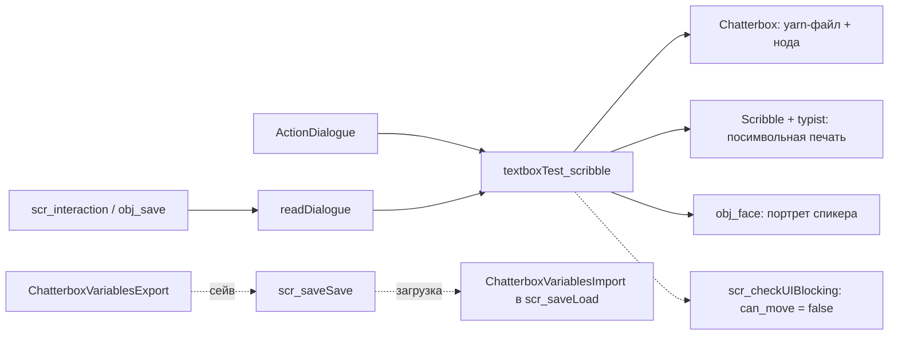

# Диалоги

Пайплайн диалогов: Yarn-файлы из `datafiles/Dialogues/` проигрываются через Chatterbox, окно `textboxTest_scribble` печатает текст через Scribble, портрет говорящего вычисляет `obj_face` по speaker-тегам строки, а всплывающие эмоции над персонажами рисует глобальная emote-система.

## Обзор



Единая точка входа для игрового кода: `readDialogue(_filename, _nodename)`. В катсценах окно создаёт и контролирует `ActionDialogue` (см. [классы действий](../cutscenes/action-classes.md)).

## Точка входа `readDialogue`

```gml title="scripts/readDialogue/readDialogue.gml"
function readDialogue(_filename, _nodename)
```

| Параметр | Тип | Описание |
|----------|-----|----------|
| `_filename` | `string` | Имя yarn-файла из `datafiles/Dialogues/` (например, `"fountain.yarn"`) |
| `_nodename` | `string` | Имя стартовой ноды (`title:`) внутри файла |
| return | `instance` | id созданного `textboxTest_scribble` или `noone`, если окно уже открыто |

Функция создаёт `textboxTest_scribble` на слое `Instances` (через `scr_layer_ensure_instances`) в точке `(0, 0)`: окно рисуется в Draw GUI, мировые координаты не используются. Инстансу выставляются `is_dialogue_requested = true`, `dialogue_filename`, `dialogue_node`. Движение игрока здесь не блокируется вручную: окно входит в `scr_ui_objects_list()`, и `scr_player_ui_blocking()` сам выставит `obj_player.can_move = false` на ближайшем Step.

Вызывается из `scr_interaction` ([взаимодействие](interaction.md)) и из `obj_save/Step_0`: точка сохранения может показать диалог (`dialogue_filename`/`dialogue_node` задаются в свойствах инстанса, пример: `obj_save` в `rm_road_curve` → `fountain.yarn`, нода `RM_002: FOUNTAIN`).

## Формат Yarn-файлов

Файлы лежат в `datafiles/Dialogues/` (`testDialogue.yarn`, `testDialogueBlue.yarn`, `testChoices.yarn`, `fountain.yarn`). Нода — блок между `title: <имя>` + `---` и `===`; строки `__PrivCrochet_*` — метаданные редактора Crochet.

```yaml title="datafiles/Dialogues/testDialogue.yarn (фрагмент)"
title: Bench
---
Chara [chara:question]: Hey, Chara![delay, 400] I was looking for you everywhere!
Chara [chara]: So,[delay, 500] how's your day going?
[]
-> Nothing special, staring at the sun
    Chara [chara:question]: Hey, don't do that!
-> Nothing special, eating babies
    Chara [chara:question]: Ha-ha,[delay, 1000] funny. At least don't eat your brother for the god's sake, I guess.
Chara [chara]: How about we go grab a lunch after you finish your lessons?
===
```

- **Speaker-строка**: `DisplayName [code:emotion]: текст`. `DisplayName` необязателен; `[code]`: ключ актёра, `[code:emotion]`: актёр + эмоция (парсит `scr_parse_emote`).
- Опции: маркер `[]`, затем `-> вариант` с отступом на строки ветки. Окно показывает максимум 4 опции: при большем числе отрисовываются первые 4 и пишется warning в лог (один раз на экран опций: флаг сбрасывается, когда опции исчезают).
- Команды `<<...>>`: стандартные `<<jump Node>>`, `<<wait>>` и зарегистрированные игрой `<<c_*(...)>>`, мост в катсценную систему (`cutscene_register_chatterbox_functions()` в `obj_Init/Create_0`, ~40 функций через `ChatterboxAddFunction`, см. [GML DSL катсцен](../cutscenes/gml-dsl.md)).
- Эффекты текста: `[wave]`, `[delay, мс]`, `[c_red]…[/c]`: разметка Scribble; литеральная `[` пишется как `[[`.
- Переменные: `$var` и счётчики `visited(нода)` живут в глобальном scope Chatterbox и попадают в сейв (см. ниже).

## Объект `textboxTest_scribble`

Непersistent-объект без спрайта; события: `Create_0`, `Step_1` (Begin Step), `Step_0`, `Draw_64`, `CleanUp_0`. Вся логика — в Step, Draw только рисует.

### Create_0: инициализация

- Создаёт `obj_face`, если его нет: портретный рендерер должен жить всё время существования окна.
- `typist = scribble_typist()`: `typist.in(char_speed / fps, 0)`: печать со скоростью `char_speed` (по умолчанию `21`) символов в секунду; `typist.sound(global.current_voice, 2000, 1, 1)`: голосовой «блип»; `typist.execution_scope(id)` + `typist.function_per_char(callback)`: per-char callback для анимации рта.
- Дефолты состояния: `text`, `text_plain`, `actor_prev`/`emotion_prev`/`display_name_prev`, `mouth_open_prev`/`mouth_closed_prev`/`sound_prev`, параметры talk-анимации (`talk_chance = 0.6`, `talk_hold_frames = 6` в 30-FPS эквиваленте, `talk_max_consecutive = 7`, `talk_pause_symbols = 3`).
- Флаги катсцен: `typing_done`, `prevent_skip`, `stay_open`, `auto_advance`, `auto_advance_delay = 30` кадров. Поле `non_blocking` в Create не объявлено; его ставит `ActionDialogue`.
- Layout-константы двух пресетов (с портретом / без): масштаб, padding, wrap, позиции маркера и портрета; слоты опций для 1–4 вариантов; параметры nameplate; кэши Scribble-элементов (`__cache_*`).

### Step_1 (Begin Step): до обновления портрета

Если `ChatterboxGetOptionCount(chatterbox) > 0`, обнуляет `global.current_sprite`, чтобы `obj_face` скрыл портрет в том же кадре, где появились опции.

### Step_0: state machine

Фазы жизни окна:

1. Запрос (`is_dialogue_requested`): файл грузится через `ChatterboxLoadFromFile`, только если `!ChatterboxIsLoaded(filename)`: повторная загрузка инвалидирует живые chatterbox'ы того же файла. Наличие файла проверяется `file_exists(CHATTERBOX_INCLUDED_FILES_SUBDIRECTORY + "/" + name)` (`"Dialogues"`). Затем `ChatterboxCreate(filename)`, `chatterbox.FindNode(node)` и `ChatterboxJump`. Отсутствие файла/ноды не фатально: пишется `show_debug_message`, запрос считается мгновенно завершённым (`_request_failed`), окно уничтожается в конце Step.
2. Синхронизация строки (`apply_current_dialogue_state()`): берёт последнюю content-строку (`ChatterboxGetContentCount`, `ChatterboxGetContentSpeaker`, `ChatterboxGetContentSpeakerData`, `ChatterboxGetContentSpeech`), парсит портрет через `scr_parse_emote`, применяет forced-эмоцию из `global.__actor_forced_emotion` (consume-once), обновляет `mouth_*_prev`/`sound_prev`, `global.current_sprite`/`global.current_voice`, `typist.sound()`, `text` и `text_plain` (копия без scribble-тегов для per-char callback). Экран без реплики (только опции/команды) обнуляет текст и talk-state.
3. Ввод (`scr_input_pressed("confirm")` → `_advance_requested`):
   - есть опции → `ChatterboxSelect(chatterbox, selected_option)`;
   - текст печатается → `typist.skip()` (если `!prevent_skip`);
   - текст допечатан и `ChatterboxIsWaiting` → `ChatterboxContinue`.
   После выбора/продолжения выполняется повторный `apply_current_dialogue_state()` и `typist.reset()`.
4. Опции: навигация стрелками в `selected_option`. Для 1–3 опций используется циклический left/right (+ up/down для 3), для 4 применяется `nav_map` ромбовидной раскладки (0=левый, 1=правый, 2=нижний, 3=верхний).
5. Завершение: `ChatterboxIsStopped(chatterbox)` (или отклонённый запрос) и `!stay_open` → `instance_destroy(self)`. Блокировка игрока снимается сама: `scr_player_ui_blocking` пересчитывает `can_move` каждый Step.

### Draw_64: отрисовка (Draw GUI)

- Бокс `spr_dialogue_box` масштабируется до `gui_width - 100` × `gui_height / 3`, внизу экрана; выбор пресета по `sprite_exists(global.current_sprite)`.
- **Nameplate**: подложка `textbox_menuingame` + имя `display_name_prev` шрифтом `ft_menuFont`; скрывается у narrator (пустое имя), при опциях и при `nameplate_visible = false`. Ширина: auto-fit под текст + padding (`nameplate_auto_fit_width`, минимум `nameplate_min_width`).
- Портрет: `global.current_sprite` по `portrait_*`-константам активного пресета.
- Текст: Scribble-элемент `scribble(text)` с `.scale()`, `.line_spacing("107%")`, `.padding(0,0,0,0)`, `.wrap(width, height)`; кэшируется по сигнатуре «текст+масштаб+рамка». Рисуется `textScribble.draw(x, y, typist)`; typist управляет посимвольным reveal. Маркер `>` показывается только без портрета и после допечатки (`typist.get_state() == 1`).
- Опции: при активных опциях основной текст не рисуется; тексты опций (`ChatterboxGetOptionSpeech`) переносятся собственным word-wrap с замером ширины пробниками Scribble, шаг строки: разность высот двух пробников; выбранная опция рисуется `blend(c_red)`, остальные `c_white`.
- Шрифт `ft_menuFont` (кириллица); `scribble_font_set_default`/`draw_get_font` сохраняются и восстанавливаются в конце события.

### CleanUp_0

Уничтожает `obj_face`, если это был последний `textboxTest_scribble` (портрет может понадобиться другому окну).

### Флаги поведения

| Поле | По умолчанию | Кто ставит | Поведение |
|------|--------------|------------|-----------|
| `non_blocking` | не объявлено | `ActionDialogue` (`= !block_queue`) | `true`: `scr_checkUIBlocking_raw` пропускает инстанс: окно не блокирует игрока |
| `auto_advance` | `false` | `ActionDialogue`, `ActionDialogueControl` | после допечатки ждёт `auto_advance_delay` (30 кадров) и эмулирует confirm; на репликах с опциями не действует |
| `stay_open` | `false` | `ActionDialogueControl` | окно не уничтожается после `ChatterboxIsStopped`: переиспользуется следующим `ActionDialogue`, закрывается `ActionClearDialogue` |
| `prevent_skip` | `false` | `ActionDialogueControl` | confirm не вызывает `typist.skip()` во время печати |
| `char_speed` | `21` (символов/с) | `ActionSetDialogueSpeed` | скорость печати; менеджер хранит `dialogue_char_speed` и применяет к каждому новому окну |

## Chatterbox: узлы, переменные, сейв

- `obj_Init/Create_0` при старте зовёт `ChatterboxLoadFromFile("testDialogue.yarn")` и `cutscene_register_chatterbox_functions()`; остальные файлы подгружаются окном по месту.
- Переменные Chatterbox (включая счётчики `visited(...)`, без констант) экспортируются строкой через `ChatterboxVariablesExport()`; `scr_saveSave` пишет её отдельной строкой в формате сейва v3+.
- `scr_saveLoad` при загрузке: секция, начинающаяся с `{`, → `ChatterboxVariablesImport(_chatterbox_str)` (битый JSON ловится `try/catch` с warn); пустая или не-JSON секция (сейвы v1/v2) → `ChatterboxVariablesResetAll()` + `ChatterboxVariablesClearVisitedAll()`. Восстановление выполняется при любом `_change_room`: флаг `false` пропускает только переход в комнату и сброс runtime-сессии (его использует тестовый стенд).
- `scr_defaultLoad` («новая игра») сбрасывает переменные и visited-метки тем же `ResetAll` + `ClearVisitedAll`.

## Портреты: `obj_face` и speaker-теги

`obj_face` — портретный рендерер: не рисует сам (`Draw_64` = `exit`), а в `Step_2` (End Step) выбирает кадр для `Draw_64` окна:

1. Находит активный `textboxTest_scribble` (не stopped или `stay_open`).
2. При опциях, отсутствии окна или невалидном `mouth_closed` выставляется `global.current_sprite = noone`.
3. Иначе читает `mouth_closed_prev`/`mouth_open_prev`/`talk_open_now` окна: `talk_open_now` → `mouth_open` (рот открыт), иначе `mouth_closed`; итог пишет в `global.current_sprite`.

### `scr_parse_emote`

```gml title="scripts/scr_parse_emote/scr_parse_emote.gml"
scr_parse_emote(_speaker_data_raw, _display_raw, _actor_prev, _emotion_prev, _display_prev, _forced_emotion)
// → { actor, emotion, display_name, mouth_closed, mouth_open, sound }
```

Разбирает `code:emotion` по первому `:` (ключи: lowercase + trim). Правила:

- пустой actor → narrator (ресурсы из `map_emotions("", "")`; `display_name`: имя из строки, если написано);
- пустая emotion + тот же actor → наследуется `emotion_prev`; новый actor без emotion → `"default"`;
- `display_name`: имя из строки → таблица `actor_display_name(code)` → имя предыдущей строки того же актёра → `""`;
- `_forced_emotion` (непустая): принудительная эмоция из катсцены, побеждает разбор строки.

### `map_emotions` и `actor_display_name`

`map_emotions(_actor, _emotion)` → `{ mouth_closed, mouth_open, sound, idle_sprite }`. Static-карта: `narrator.default` (без спрайтов, `snd_text_ch1`), `chara.default` и `chara.question` (`chara_question_c`/`chara_question_o`). Неизвестный actor → ветка `narrator`, неизвестная emotion → `actor.default`. `actor_display_name(_actor_key)`: таблица «code → имя» для nameplate (`chara` → `"Chara"`). Новый персонаж = новая ветка в `map_emotions` + запись в `actor_display_name`.

Forced-эмоции пишут `ActionSetPortraitNext` и `ActionSetEmotion` в `global.__actor_forced_emotion[actor]`; окно забирает запись consume-once по актёру текущей строки и перепарсивает её с forced-эмоцией. `ActionSetPortraitNow` перезаписывает `mouth_*_prev`/`sound_prev` окна напрямую.

### Анимация рта

Per-char callback typist срабатывает на каждом показанном глифе: знаки препинания (`.`, `!`, `?`, `:`, `;`, `…`, `-`, `—`) пропускаются, на остальных с шансом `talk_chance` рот открывается на `talk_hold_frames`; после `talk_max_consecutive` открытий подряд идёт принудительная пауза на `talk_pause_symbols` символов. `update_talk_animation_state()` гасит hold и выставляет `talk_open_now` для `obj_face`.

## Эмоуты (emote bubbles)

Глобальная система в `scripts/scr_emote_system/scr_emote_system.gml`; хранилище `global.global_emote_system = { active_emotes: [] }` создаёт `obj_Init`. Тикает `emote_step()` (`obj_globalManager/Step_0`), рисует `emote_draw_gui(camx, camy, scale, ox, oy)` (`obj_globalManager/Draw_64`): позиция `(target.x - camx) * scale`, `target.bbox_top - camy`, то есть пузырь висит над головой цели.

```gml title="scripts/scr_emote_system/scr_emote_system.gml"
_emote = emote_show(_target, _sprite, _duration, _offset_x, _offset_y, _scale);
```

| Параметр | Default | Описание |
|----------|---------|----------|
| `_target` | — | Инстанс или object index (приводится к `instance_find(target, 0)`); несуществующая цель → `noone` |
| `_sprite` | `undefined` | Индекс спрайта или имя; строка ищется как есть и с префиксом `spr_` (`emote_resolve_sprite`); `undefined` здесь → `noone`, без fallback |
| `_duration` | `60` | Время жизни в кадрах игры (минимум `EMOTE_MIN_DURATION_FRAMES` = 1) |
| `_offset_x`, `_offset_y` | `0`, `-24` | Смещение от центра / верхней границы спрайта цели |
| `_scale` | `1` | Масштаб (минимум 0.1) |

`emote_step` каждый кадр уменьшает `frames_left`, крутит `image_index` и удаляет эмоцию по истечении времени или гибели цели. `emote_hide_all_for(_target)` и `emote_hide_all()` — пустые заглушки (`DELETE_CANDIDATE`): вызовов нет, эмоции умирают только по таймеру.

Точки вызова `emote_show`: `cutscene_runtime_show_emote()`: общий вход для `c_emote` (yarn-команда), `ActionEmote` и JSON-действия `show_emote`/`emote`; там спрайт резолвит `cutscene_runtime_resolve_emote_sprite` с fallback'ом `default_emote_sprite` из `cutscene_engine_settings.json` (`"chara_question_o"`), а при битом имени подставляются жёсткие `chara_question_o` и `chara_question_c`.

## Кто пишет `seen_dialogues`

Массив `seen_dialogues` живёт на инстансах `par_interactable` и наполняется в `scr_interaction`: после успешного взаимодействия туда пушится ключ `"<yarn-файл>:<нода>"` (без дублей), `interaction_count++`, затем `__entity_state_save()` сбрасывает запись в `global.entity_state`; реестр сериализуется в сейв и восстанавливается методом `__entity_state_restore` при спавне сущности. Подробнее: [Взаимодействие](interaction.md), [Система сохранений](save-system.md), [Форматы данных](../architecture/data-formats.md).

## Troubleshooting

!!! warning "Окно диалога не появляется"
    `readDialogue` возвращает `noone`, если `textboxTest_scribble` уже существует: второй вызов молча отклоняется. Также проверьте, что файл лежит в `datafiles/Dialogues/`, а нода есть в файле: промахи пишут `show_debug_message` и завершают окно без фатальной ошибки.

!!! warning "Нода с больше чем 4 опциями"
    Отрисовываются только первые 4 (`options_overflow_warned` пишет warning один раз на экран опций; флаг сбрасывается, когда опции исчезают). Навигация ограничена тем же числом.

!!! note "Перезагрузка yarn-файла"
    `ChatterboxLoadFromFile` вызывается только для ещё не загруженных файлов: повторная загрузка выгружает source и инвалидирует все живые chatterbox'ы на нём. Динамической перезагрузки контента в рантайме нет.

!!! note "Символ `[` в тексте или имени"
    `[` — начало scribble-тега. Литеральная скобка экранируется как `[[`; окно сам экранирует `display_name` перед подачей в Scribble, а пустой текст опции подменяется на `[[error]`.

## См. также

- [Взаимодействие](interaction.md) — `scr_interaction`, `par_interactable`, `entity_state`
- [Система сохранений](save-system.md) — `scr_saveSave`/`scr_saveLoad`, слоты
- [Интерфейс и меню](ui-and-menus.md) — `scr_checkUIBlocking`, `scr_ui_objects_list`
- [Классы действий катсцен](../cutscenes/action-classes.md) — `ActionDialogue`, `ActionDialogueControl`, `ActionSetPortrait*`, `ActionEmote`
- [JSON-действия катсцен](../cutscenes/json-actions.md) — `dialogue`, `dialogue_control`, `show_emote`, `set_portrait_*`
- [GML DSL катсцен](../cutscenes/gml-dsl.md) — `c_dialogue`, `c_emote` и регистрация в Chatterbox
- [Инициализация](../architecture/initialization.md) — `obj_Init`: `global_emote_system`, `ChatterboxLoadFromFile`

<!-- sources: scripts/readDialogue/readDialogue.gml; objects/textboxTest_scribble/Create_0.gml; objects/textboxTest_scribble/Step_0.gml; objects/textboxTest_scribble/Step_1.gml; objects/textboxTest_scribble/Draw_64.gml; objects/textboxTest_scribble/CleanUp_0.gml; objects/textboxTest_scribble/textboxTest_scribble.yy; objects/obj_face/Create_0.gml; objects/obj_face/Step_2.gml; objects/obj_face/Draw_64.gml; objects/obj_face/obj_face.yy; scripts/scr_parse_emote/scr_parse_emote.gml; scripts/map_emotions/map_emotions.gml; scripts/actor_display_name/actor_display_name.gml; scripts/scr_emote_system/scr_emote_system.gml; scripts/scr_checkUIBlocking/scr_checkUIBlocking.gml; scripts/scr_player_ui_blocking/scr_player_ui_blocking.gml; scripts/scr_saveSave/scr_saveSave.gml:128-136; scripts/scr_saveLoad/scr_saveLoad.gml:272-296; scripts/scr_defaultLoad/scr_defaultLoad.gml:35-40; scripts/interactionWithNPCsOrObjects/interactionWithNPCsOrObjects.gml:83-110; objects/par_interactable/Create_0.gml:26-74; scripts/scr_entity_state/scr_entity_state.gml:1-57; scripts/scr_cutscene_classes/scr_cutscene_classes.gml:44-54, 1212-1269, 2505-2632, 2783-2893, 3166-3200; scripts/c_cmd/c_cmd.gml:141-209, 250-253; scripts/cutscene_action_factory/cutscene_action_factory.gml:155-205, 906-918; scripts/cutscene_load_engine_settings/cutscene_load_engine_settings.gml:112; datafiles/cutscenes/cutscene_engine_settings.json:7; scripts/scr_stress_tests/scr_stress_tests.gml:770, 808-830; objects/obj_Init/Create_0.gml:261-275; objects/obj_globalManager/Step_0.gml:48; objects/obj_globalManager/Draw_64.gml:160; objects/obj_save/Step_0.gml; scripts/scr_inventory_init/scr_inventory_init.gml:50-58; scripts/ChatterboxVariablesExport/ChatterboxVariablesExport.gml; datafiles/Dialogues/testDialogue.yarn; datafiles/Dialogues/testChoices.yarn; datafiles/Dialogues/fountain.yarn -->
