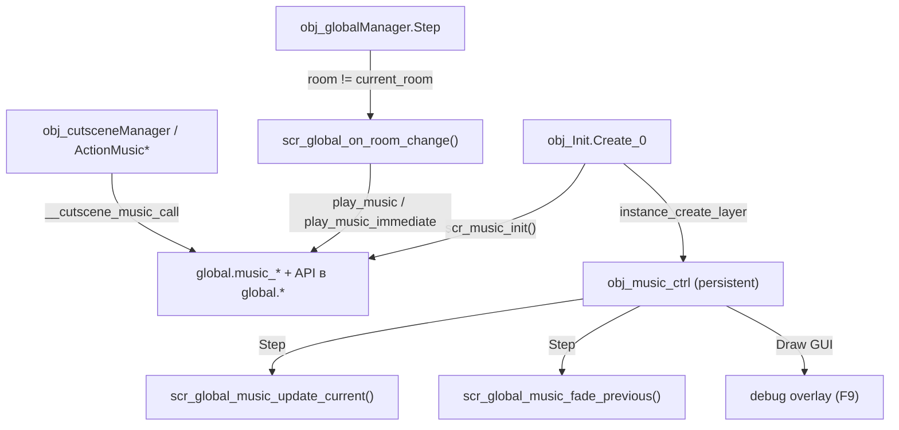

# Музыка и звук

Музыкальный движок с time-based фейдами, intro+loop, двухслойными треками (calm/battle), приглушением и фазовыми последовательностями. Весь API — функции в `global.*`, создаваемые `scr_music_init()`; покадровое обновление выполняет persistent-контроллер `obj_music_ctrl`.

## Архитектура

| Файл | Роль |
|------|------|
| `scripts/scr_music_init/scr_music_init.gml` | Глобалы движка и весь публичный API (функции присваиваются в `global.*`). Вызывается один раз из `obj_Init.Create_0`; при повторном вызове живые аудио-инстансы сначала останавливаются. |
| `objects/obj_music_ctrl/` | Persistent-контроллер: Step — тик фейдов, Draw GUI — debug overlay. |
| `scripts/scr_global_music_update_current/scr_global_music_update_current.gml` | Тик текущего трека: volume-fade, duck-интерполяция, авто-рестарт из нулевой громкости, авто-стоп на нуле, переход intro → loop / intro → layered. |
| `scripts/scr_global_music_fade_previous/scr_global_music_fade_previous.gml` | Затухание prev-каналов (ушедший трек и его battle-слой) по общему таймеру; на нуле — `audio_stop_sound`. |
| `scripts/scr_global_on_room_change/scr_global_on_room_change.gml` | Выбор трека при смене комнаты (см. ниже). |
| `scripts/scr_cutscene_music/scr_cutscene_music.gml` | Action-классы `ActionMusic*` и защищённый вызыватель `__cutscene_music_call`. |
| `scripts/scr_SFXPlay/scr_SFXPlay.gml` | `scr_play_sfx` + legacy-алиас `scr_SFXPlay`. |
| `scripts/scr_menu_volume_guard/scr_menu_volume_guard.gml` | Стек приглушения мастер-громкости на время меню. |

`obj_music_ctrl` (`persistent: true`, без спрайта и родителя): **Create** — только комментарий; **Step** — `scr_global_music_update_current()` + `scr_global_music_fade_previous()`; **Draw GUI** — debug overlay при `global.debug && global.debug_show_music` (переключатель F9 в `scr_global_debug_hotkeys`). Создаётся `obj_Init` после `scr_music_init()` на слое `scr_layer_ensure_instances()`.

## Глобальное состояние

??? note "Полный список `global.music_*`"
    | Переменная | Тип | Назначение |
    |------------|-----|------------|
    | `music_current` | sound / `noone` | Ассет текущего трека. |
    | `music_instance` | real | Играющий instance текущего трека (`-1` — нет). |
    | `music_persist_track` | sound / `noone` | Трек, переживающий смену комнаты (см. раздел про катсцены). |
    | `music_volume`, `music_volume_target` | real 0..1 | Живая громкость движка и её цель (интерполяция). |
    | `music_fade_duration`, `music_fade_timer`, `music_fade_from` | real | Time-based фейд громкости (секунды, `delta_time`). |
    | `music_volume_override` | real | `-1` — громкость из настроек; `>= 0` — ручная (`set_music_volume_fade`). Сбрасывается при смене трека. |
    | `music_pitch` | real | Текущий pitch (`1.0` — норма). |
    | `music_paused` | bool | Пауза движка. |
    | `music_prev_instance`, `music_prev_volume`, `music_prev_fade_*` | real | Prev-канал: затухающий предыдущий трек. |
    | `music_prev_layer2_instance`, `music_prev_layer2_volume`, `music_prev_layer2_fade_from` | real | Затухающий battle-слой предыдущего трека. |
    | `music_intro_instance`, `music_loop_asset` | real / sound | Состояние intro → loop. |
    | `music_intro_layered_mode`, `music_intro_layered_calm_asset`, `music_intro_layered_battle_asset`, `music_intro_layered_intensity` | — | Состояние intro → layered loop. |
    | `music_duck_multiplier`, `music_duck_target`, `music_duck_fade_*` | real 0..1 | Относительное приглушение поверх громкости настроек. |
    | `music_layered_mode`, `music_layer2_instance`, `music_layer2_asset` | — | Layer 2: синхронные calm + battle. |
    | `music_layer_intensity`, `music_layer_intensity_target`, `music_layer_fade_*` | real 0..1 | Соотношение слоёв: `0` = calm, `1` = battle. |
    | `music_default_fade` (`0.5`), `music_crossfade_lead` (`0.15`) | real | Дефолтный фейд смены трека и опережение fade-in. |
    | `music_phase_fade_default` (`0.5`), `music_phase_stop_fade` (`1.0`), `music_autorestart_fade` (`0.2`) | real | Дефолты фейдов phase manager и авто-рестарта. |
    | `music_default_game_track` | sound | Трек игровых комнат по умолчанию (`music_SchoolRoutine`). |
    | `room_music_override` | `undefined` | Зарезервированное имя: таблица переопределений room → track удалена, писателей не было. Чтение даёт `undefined`; использование имени как таблицы падает громко. |
    | `music_phase_manager` | struct | Менеджер фаз: `phases`, `phase_count`, `current_index` + методы (см. ниже). |
    | `__menu_volume_depth` | real | Глубина стека `scr_menu_volume_push` / `scr_menu_volume_pop`. |

## Музыкальный API (`scr_music_init`)

Все функции — поля `global`, определённые в `scr_music_init()`. Фейды в секундах, не зависят от FPS (`delta_time`).

| Имя | Сигнатура | Что делает |
|-----|-----------|------------|
| `play_music` | `global.play_music(snd_asset)` | Кроссфейд на новый трек за `music_default_fade`. Повторный вызов с тем же живым треком — no-op (фильтр в `play_music_fade`, не действует в layered-режиме). |
| `play_music_fade` | `global.play_music_fade(snd_asset, fade_sec)` | То же с явным фейдом; здесь же живёт фильтр «тот же живой трек». Старый трек уходит в prev-канал через `__music_handoff_to_prev`; fade-in короче на `music_crossfade_lead`. |
| `play_music_immediate` | `global.play_music_immediate(snd_asset)` | Мгновенная смена: старое гасится сразу, повтор с тем же треком — рестарт с начала (используется restore-секцией чекпоинтов катсцен). |
| `stop_music` | `global.stop_music(fade_sec)` | Остановка с затуханием; `0` — мгновенно. Перед фейдом снимает паузу, иначе тик был бы заморожен. |
| `set_music_pitch` | `global.set_music_pitch(pitch)` | Pitch текущего трека (и intro / layer2), минимум `0.01`. |
| `set_music_volume_fade` | `global.set_music_volume_fade(vol, fade_sec)` | Ручная громкость: ставит `music_volume_override` и фейд к `vol * duck`. При `fade_sec = 0` во время идущего fade-in — перенацеливает фейд, не обрывая его. |
| `play_music_intro_loop` | `global.play_music_intro_loop(intro_asset, loop_asset, fade_sec)` | Intro играет один раз (без лупа), затем `scr_global_music_update_current` запускает зацикленный `loop_asset`. |
| `play_music_intro_layered` | `global.play_music_intro_layered(intro, calm, battle, fade_sec, start_intensity)` | Intro → layered loop calm + battle; `battle = noone` даёт обычный loop. |
| `pause_music` / `resume_music` | `global.pause_music()` / `global.resume_music()` | Пауза/снятие для всех каналов: текущий, intro, prev, layer2, prev_layer2. |
| `duck_music` | `global.duck_music(multiplier, fade_sec)` | Относительное приглушение: финальная громкость = `settings_vol * multiplier`. `0.5` — вдвое тише. |
| `unduck_music` | `global.unduck_music(fade_sec)` | Снятие приглушения — обёртка `duck_music(1, fade_sec)`. |
| `play_music_layered` | `global.play_music_layered(calm_asset, battle_asset, fade_sec)` | Два синхронных зацикленных трека; стартовая интенсивность `0` (слышен только calm). |
| `set_music_layer_intensity` | `global.set_music_layer_intensity(intensity, fade_sec)` | Соотношение слоёв: `0` — только calm, `1` — только battle. Без активного layered-режима — no-op. |
| `stop_layered_music` | `global.stop_layered_music(fade_sec)` | Остановка обоих слоёв; без layered-режима откатывается на `stop_music`. |
| `play_music_phase_sequence` | `global.play_music_phase_sequence(phases, fade_sec)` | Загружает массив фаз в `music_phase_manager` и играет фазу `0`. Фаза — struct `{intro, calm, battle, intensity, fade}`; `calm` обязателен. |
| `music_phase_next` | `global.music_phase_next(fade_sec)` | Следующая фаза последовательности. |
| `music_phase_manager.*` | `set_sequence(phases)`, `play_index(i, fade)`, `play(fade)`, `next(fade)`, `set_intensity(i, fade)`, `stop(fade)`, `clear()` | Методы фазового менеджера. `play_index` выбирает путь по полям фазы: `intro` → intro+layered, `battle` → layered, иначе обычный трек. |
| `__music_get_settings_volume` | `global.__music_get_settings_volume()` | Внутренняя: целевая громкость = (`music_volume_override` если `>= 0`, иначе `__music_volume`) × `music_duck_multiplier`. |
| `__music_stop_intro`, `__music_stop_layer2` | `global.__music_stop_intro()` / `global.__music_stop_layer2()` | Внутренние хелперы остановки intro и второго слоя (учитывают паузу). |

Модульные приватные функции скрипта: `__music_handoff_to_prev(fade_sec)` — перенос уходящего трека и battle-слоя в prev-каналы; `__music_fade_lerp(timer, duration, from, to)` — линейная интерполяция по оставшемуся времени.

!!! warning "Два пространства громкости"
    `global.__music_volume` — значение слайдера настроек (источник истины из сейва; пишут `obj_Init`, `scr_applySettings`, `obj_settingsManager`). `global.music_volume` / `music_volume_target` — живое состояние движка. Прямая запись в `music_volume` обходит fade/duck-логику, а запись в `__music_volume` не даёт немедленного звука — движок синхронизируется через `set_music_volume_fade(__music_volume, 0)`. Функций `set_music_duck` в API нет — только `duck_music` / `unduck_music`.

## SFX: scr_play_sfx и scr_SFXPlay

`scr_play_sfx(sound_or_key, [volume], [pitch], [fallback_sound])` — проигрывание эффектов с учётом настроек. Первый аргумент полиморфен:

- строка — ключ `global.ui_sfx_map` (`"move"`, `"confirm"`, `"back"`, `"erase"`, `"error"`, `"save"`); при отсутствии ключа — имя звукового ассета через `asset_get_index`;
- число — индекс звукового ассета напрямую;
- если ничего не разрешилось — `fallback_sound`, а затем `global.ui_snd_select`.

Итоговая громкость = `volume * clamp(global.__sfx_volume, 0, 1)`; до инициализации `__sfx_volume` играет на полной. `scr_SFXPlay(action, [volume], [pitch])` — legacy-алиас с `ui_snd_select` как fallback (имя сохранено ради ~70 точек вызова).

`ui_sfx_map` и `ui_snd_select` задаёт `obj_Init.Create_0`: все ключи пока указывают на `snd_text_ch1` — единственный SFX-ассет-звук интерфейса; он же — дефолтный voice-blip диалогов (`map_emotions` → `global.current_voice`).

## Громкости и настройки

| Глобал | Кто пишет | Кто читает |
|--------|-----------|------------|
| `global.__current_master_volume` | `obj_Init` (дефолт `1.0`), `scr_applySettings`, `obj_settingsManager` (слайдер мастера), `scr_menu_volume_push`/`pop` | `audio_master_gain` — применяется на месте записи |
| `global.__music_volume` | `obj_Init` (дефолт), `scr_applySettings`, `obj_settingsManager` (слайдер музыки) | `__music_get_settings_volume` (цель фейдов движка) |
| `global.__sfx_volume` | `obj_Init` (дефолт), `scr_applySettings`, `obj_settingsManager` (слайдер SFX) | `scr_play_sfx` |

Источник истины — `global.player_settings.master_volume` / `music_volume` / `sfx_volume` (файл `player_settings.dat`). `scr_menu_volume_push(target = 0.8)` на время меню ставит `audio_master_gain` в 80 % текущего с учётом вложенности (`__menu_volume_depth`); `scr_menu_volume_pop` на нуле стека восстанавливает `player_settings.master_volume` — а не снимок, чтобы изменённые внутри настройки значения не откатывались. Вызывают: `obj_p3r_pause` (Create/Destroy), `obj_inGameMenu` (ручной push при overlay-настройках), `obj_settingsManager` / `scr_settings_step_root` (pop при выходе).

## Аудио-ассеты (`sounds/`)

Все звуки лежат в `audiogroup_default`, `sampleRate 44100`, без preload. Конвенция имён: `music_*` / `mus_*` — музыка, `snd_*` — эффекты.

| Ассет | Файл | Длительность | Использование |
|-------|------|--------------|----------------|
| `music_menu` | `music_menu.ogg` | 42.7 c | Меню-комнаты (`scr_global_on_room_change`), форс-запуск в `obj_menu` и `obj_p3r_title`. |
| `music_SchoolRoutine` | `music_SchoolRoutine.ogg` | 138.4 c | `global.music_default_game_track` — дефолт игровых комнат. |
| `mus_intro` | `mus_intro.wav` | 79.0 c | Intro-фазы в `obj_sound_test`; `play_music_intro` / `play_music_intro_layered` в `datafiles/cutscenes/cutscene.json`. |
| `mus_loop_calm_loud` | `mus_loop_calm_loud.wav` | 175.7 c | Calm-слой фаз (`volume` ассета `0.39`), `obj_sound_test`; `play_boss_music` / `boss_music_phase` / `play_music_intro_layered` в `cutscene.json`. |
| `mus_loop_battle` | `mus_loop_battle.wav` | 175.7 c | Battle-слой фаз, `obj_sound_test`; те же типы в `cutscene.json`. |
| `mus_end` | `mus_end.wav` | 36.0 c | Ассет есть, вызовов в коде и `datafiles` нет. |
| `snd_text_ch1` | `snd_text_ch1.wav` | 1.7 c | Все ключи `ui_sfx_map`, `ui_snd_select`, дефолтный voice-blip диалогов. |
| `snd_wobble` | `snd_wobble.wav` | 0.33 c | `play_sfx` в тестовой `datafiles/cutscenes/cutscene.json`; calm/battle-слои в `cutscenes/tests/*.json`. |

## Музыка при смене комнаты

`obj_globalManager.Step` при `room != current_room` вызывает `scr_global_on_room_change(current_room, room)`:

- Целевой трек: `music_menu`, если `global.is_menu_room(new_room)` (список `global.__service_menu_rooms`: `rm_roomMenu`, `rm_savesSelect`, `rm_settings`, `rm_devLoad`), иначе `global.music_default_game_track`.
- Граница меню ↔ игра — мгновенная смена `play_music_immediate`; внутри группы — кроссфейд `play_music`.
- Persist-гард: если `global.cutscene_active`, `music_persist_track == music_current` и instance жив — комнатная музыка трек не перезаписывает. Пометка самоочищающаяся: после любой явной смены `persist_track != music_current`.

## Музыка и катсцены

Action-классы (`scr_cutscene_music.gml`) дергают движок через `__cutscene_music_call(func_name, args)` — вызов глобальной функции по имени с разворачиванием массива аргументов и warning, если её нет.

| Класс | JSON-тип (`cutscene_action_factory`) | Вызывает |
|-------|--------------------------------------|----------|
| `ActionMusicPlay(snd, fade, volume = 1.0, persist = true)` | `play_music` (`sound`/`track`, `fade`/`fade_in_seconds`, `volume`, `persist_room_change`) | `play_music_fade` / `play_music_immediate` + `set_music_volume_fade` (только при `volume != 1.0`); пишет `global.music_persist_track` |
| `ActionMusicStop(fade, use_layered)` | `stop_music`, `stop_boss_music` | `stop_music` / `stop_layered_music` |
| `ActionMusicVolume(vol, fade)` | `music_volume` | `set_music_volume_fade` |
| `ActionMusicPitch(pitch)` | `music_pitch` | `set_music_pitch` |
| `ActionMusicPause` / `ActionMusicResume` | `music_pause` / `music_resume` | `pause_music` / `resume_music` |
| `ActionMusicDuck(mult, fade)` / `ActionMusicUnduck(fade)` | `music_duck` (`multiplier`) / `music_unduck` | `duck_music` / `unduck_music` |
| `ActionMusicPlayLayered(calm, battle, fade)` | `play_boss_music` (`calm`, `battle`, `fade`) | `play_music_layered` |
| `ActionMusicSetIntensity(intensity, fade)` | `crossfade_music` (`intensity`, `fade`) | `set_music_layer_intensity` |
| `ActionMusicIntroLoop(intro, loop, fade)` | `play_music_intro` (`intro`/`sound`, `loop`/`track`) | `play_music_intro_loop` |
| `ActionMusicIntroLayered(intro, calm, battle, fade, intensity)` | `play_music_intro_layered` | `play_music_intro_layered` |
| `ActionMusicPhaseSequence(phases, fade)` | `boss_music_phase` (`phases[]`) | `play_music_phase_sequence` |
| `ActionPlaySFX(sound, volume, pitch)` | `play_sfx` | `scr_play_sfx` (через обёртку `cutscene_runtime_play_sfx`) |

Живые shorthand-обёртки — только `cutscene_music_pitch`, `cutscene_music_pause`, `cutscene_music_resume`; остальные экшены фабрика собирает через `new` напрямую.

**Persist-трек.** `ActionMusicPlay` с `persist_room_change = true` (дефолт и в конструкторе, и в JSON) ставит `global.music_persist_track = snd`, при `false` или при не-persist вызове пометка снимается (`noone`). Действует, пока идёт катсцена; на финале `finish_cutscene` (`obj_cutsceneManager/Create_0.gml`) делает `unduck_music(0)` — на случай забытого приглушения — и сбрасывает `music_persist_track = noone`, после чего смена комнаты снова выбирает трек комнаты.

**Checkpoint snapshot/restore.** `ActionCheckpointState` с `include_music` (дефолт `true`) пишет в snapshot секцию `music`: `current_track`, `volume`, `pitch`, `paused`, `duck_multiplier`, `layered_mode`, `layer2_asset`, `layer_intensity`, `persist_track`. `ActionRestoreState` с `restore_music` вызывает `__cutscene_restore_music_state`: валидирует ассет через `audio_exists`, перезапускает трек `play_music_immediate`, при layered-снимке поднимает слои `play_music_layered` + `set_music_layer_intensity`, затем восстанавливает `set_music_pitch`, `duck_music`, `persist_track`, `set_music_volume_fade` и при необходимости `pause_music`.

## Debug overlay

При `global.debug` и `global.debug_show_music` (F9) `obj_music_ctrl.Draw GUI` рисует панель: имя трека, позиция/длительность, `Vol → target` с процентом фейда, pitch, `Duck → target`, instance id и статус, состояние intro → loop, prev-канал, `PAUSED`, а в layered-режиме — имена слоёв и интенсивность с цветовой шкалой calm → battle.

`obj_sound_test` — тестовый объект звуковой комнаты: открывает меню по `confirm`, запускает двухфазную последовательность через `play_music_phase_sequence` на `mus_intro` / `mus_loop_calm_loud` / `mus_loop_battle`, гоняет `set_music_layer_intensity` и `music_phase_next`.

## См. также

- [Переходы между комнатами](room-transitions.md) — `scr_global_on_room_change`, антизастревание
- [Катсцены: JSON-экшены](../cutscenes/json-actions.md) — поля музыкальных типов
- [Катсцены: Action-классы](../cutscenes/action-classes.md) — `CutsceneAction`, чекпоинты
- [UI и меню](ui-and-menus.md) — `obj_settingsManager`, слайдеры громкости
- [Отладка и тестирование](debug-and-testing.md) — debug-горячие клавиши, `obj_sound_test`
- [Глобальное состояние](../architecture/global-state.md) — `music_*`, `__music_volume`, `player_settings`
- [Инициализация](../architecture/initialization.md) — `obj_Init`, порядок `scr_music_init`

<!-- sources: scripts/scr_music_init/scr_music_init.gml; objects/obj_music_ctrl/Create_0.gml; objects/obj_music_ctrl/Step_0.gml; objects/obj_music_ctrl/Draw_64.gml; objects/obj_music_ctrl/obj_music_ctrl.yy; scripts/scr_global_music_update_current/scr_global_music_update_current.gml; scripts/scr_global_music_fade_previous/scr_global_music_fade_previous.gml; scripts/scr_SFXPlay/scr_SFXPlay.gml; scripts/scr_cutscene_music/scr_cutscene_music.gml; scripts/scr_global_on_room_change/scr_global_on_room_change.gml; scripts/scr_menu_volume_guard/scr_menu_volume_guard.gml; scripts/scr_settingsManager/scr_settingsManager.gml:262-344; objects/obj_Init/Create_0.gml:42-55,101-115,176-195,264-281; objects/obj_cutsceneManager/Create_0.gml:667-760; scripts/scr_cutscene_classes/scr_cutscene_classes.gml:784-837,1011-1073,1271-1273,3155-3164; scripts/cutscene_action_factory/cutscene_action_factory.gml:642-904; objects/obj_globalManager/Step_0.gml:20-32; objects/obj_settingsManager/Create_0.gml:170-269; objects/obj_inGameMenu/Step_0.gml:76-87; objects/obj_p3r_pause/Create_0.gml; objects/obj_p3r_pause/Destroy_0.gml; objects/obj_sound_test/Step_0.gml; objects/obj_menu/Create_0.gml:17-18; objects/obj_p3r_title/Create_0.gml:64-65; scripts/scr_global_debug_hotkeys/scr_global_debug_hotkeys.gml:64-68; scripts/map_emotions/map_emotions.gml; sounds/*/*.yy -->
