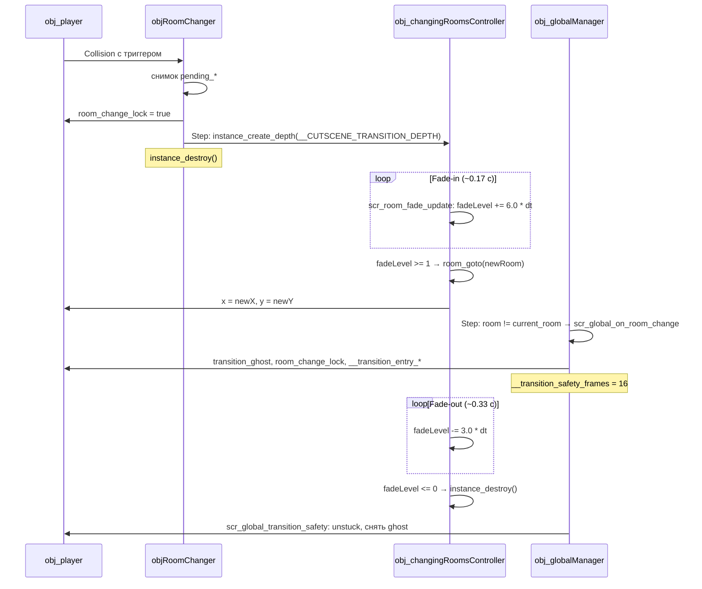

# Переходы между комнатами

Fade-переходы между комнатами: триггер `objRoomChanger` запускает persistent-контроллер `obj_changingRoomsController`, который затемняет экран, выполняет `room_goto` и ставит игрока в целевую точку. Побочные эффекты смены комнаты (музыка, антизастревание) обрабатывает `obj_globalManager` через `scr_global_on_room_change` и `scr_global_transition_safety`.

## Обзор

Переход строится на двух объектах:

- `objRoomChanger`: невидимый триггер (спрайт `spr_rmChanger`, `visible: false`, `persistent: false`), размещается в комнате в редакторе. При касании игрока снимает свои параметры и на следующем Step создаёт контроллер.
- `obj_changingRoomsController`: persistent-контроллер фейда. Живёт до конца затухания в новой комнате и самоуничтожается.

## objRoomChanger: триггер в комнате

Свойства объекта (объявлены в `objRoomChanger.yy`, задаются в редакторе комнаты через Object Properties или в Instance Creation Code):

| Свойство | Тип | Описание |
|----------|-----|----------|
| `room_name` | asset (комната, фильтр `GMRoom`) | Целевая комната перехода. |
| `x_position` | число | Целевой X игрока. `-1`: ось не настроена, берётся X самого триггера. `0`: валидная координата. |
| `y_position` | число | Целевой Y игрока, тот же контракт `-1`. |
| `eyes_glow` | bool | Во время фейда поверх затемнения рисуется спрайт игрока через `shd_Chara_Eyes` (эффект светящихся глаз). |

События (`eventList` в `.yy`):

- Create: `pending_change = false`. Снимок параметров здесь не делается: он выполняется в Collision, когда уже применены и property-overrides, и InstanceCreationCode.
- Collision с `obj_player` имеет два выхода: переход уже идёт (`instance_exists(obj_changingRoomsController)`) или игрок ещё не покинул хитбокс (`other.room_change_lock`). Затем взводит `room_change_lock` у игрока (`other.room_change_lock = true`), копирует параметры в `pending_x` / `pending_y` / `pending_room` / `pending_glow` и ставит `pending_change = true`.
- Step: при `pending_change` повторно проверяет отсутствие контроллера (переход мог стартовать из `ActionRoomChange` или загрузки сейва; тогда триггер самоуничтожается), создаёт `obj_changingRoomsController` на глубине `__CUTSCENE_TRANSITION_DEPTH` (`-100000`), переписывает в него `newX`, `newY`, `newRoom`, `eyesGlow` и уничтожает себя.

!!! tip "Как разместить переход"
    Поставьте `objRoomChanger` в комнате, растяните хитбокс на зону выхода и в инспекторе инстанса задайте `room_name` и при необходимости `x_position` / `y_position`. Ось, оставленная в `-1`, берётся из позиции триггера, что удобно для «двери на той же высоте».

## obj_changingRoomsController и scr_room_fade_update

`persistent: true`, события: Create, Step, Draw.

Поля Create: `newX`, `newY`, `newRoom`, `fadeLevel = 0.1` (ненулевой старт, чтобы контроллер не умер в первый же Step при внешнем переходе), `eyesGlow`, `__fade_prev_room = room`.

Step вызывает `scr_room_fade_update()`; контракт self: функция пишет поля вызывающего инстанса, вызывать только из Step контроллера.

Логика `scr_room_fade_update`:

- Скорости в долях экрана за секунду через `delta_time`: fade-in `6.0` (~0.17 с до черноты), fade-out `3.0` (~0.33 с), FPS-независимо.
- `__fade_prev_room` отличает собственный `room_goto` от внешней смены комнаты (загрузка сейва, катсцена, dev-переход): если `room` сменилась и не равна `newRoom`, цель устарела: `newRoom` принимает текущую комнату, фейд затухает на месте, контроллер не тянет игрока назад.
- При `room != newRoom` идёт нарастание; на `fadeLevel >= 1` выполняется валидация `newRoom` (`is_real` + `room_exists`, иначе `[ROOM FADE] ERROR`, сброс и уничтожение), затем `room_goto(newRoom)` и перенос `obj_player` в `newX` / `newY`.
- Перенос игрока пропускается, если на контроллере стоит `__player_pos_by_manager`: флаг вешает `ActionRoomChange`, и позицию ставит Room Start `obj_cutsceneManager` (см. [Катсцены: архитектура](../cutscenes/architecture.md)).
- При `room == newRoom` идёт затухание; на `fadeLevel <= 0`: `eyesGlow = false`, `instance_destroy()`.

Draw рисует чёрный прямоугольник `draw_rectangle(0, 0, room_width, room_height, false)` с `alpha = fadeLevel`, а при `eyesGlow` ещё и спрайт игрока под `shd_Chara_Eyes`. Событие захватывает входной draw-state (`draw_get_font`/`color`/`alpha`/`halign`/`valign`) и возвращает его в конце: `draw_set_*` в GameMaker глобальны и не сбрасываются между событиями.

## Обработка смены комнаты

`obj_globalManager` в Step сравнивает `room` с полем `current_room`; при расхождении вызывает `scr_global_on_room_change(current_room, room)` и обновляет `current_room` (`obj_globalManager/Step_0.gml:22-32`). Контракт self: функция пишет `notification_*`-поля вызывающего инстанса; вызывать только из `obj_globalManager`.

`scr_global_on_room_change(prev_room, new_room)`:

- Сбрасывает уведомление (`notification_active`, `notification_text`, `notification_timer`).
- Переключает музыку: для комнат меню (`global.is_menu_room`) ставится `music_menu`, иначе `global.music_default_game_track`. На границе меню↔игра смена мгновенная через `global.play_music_immediate`, внутри группы используется кроссфейд `global.play_music`.
- Включает антизастревание у игрока: `transition_ghost = true`, `ghost_mode = true`, `room_change_lock = true`, запоминает `__transition_entry_x` / `__transition_entry_y` и ставит окно `global.__transition_safety_frames = 16` (кадры, не секунды).

`scr_global_transition_safety()` вызывается каждый Step из `obj_globalManager`:

- Пока `global.__transition_safety_frames > 0`, проверяет `place_meeting` игрока по `obj_collider`, `par_decor`, `par_interactable`.
- При пересечении ищет свободную клетку расширяющимися кольцами (радиус 1–32 px, шаг 45°), из кандидатов кольца берёт ближайшую к `__transition_entry_*`, иначе поиск перекидывал бы игрока на дальнюю сторону стены. Перенос логируется `[TRANSITION] WARNING` с дистанцией.
- На нуле счётчика снимает только принудительную часть: `transition_ghost = false`, `ghost_mode = debug_ghost`: включённый игроком debug-призрак (F8) переживает переход.

`room_change_lock` снимает `scr_player_room_lock` (Step `obj_player`): блок держится, пока игрок пересекается с хитбоксом `objRoomChanger`, и не даёт триггеру сработать повторно на спавне.

## Что переживает переход

- Persistent-объекты: `obj_player`, `obj_globalManager`, `obj_Init`, `obj_cutsceneManager`, `obj_music_ctrl`, `obj_changingRoomsController`, `obj_pointMarker`, `o_SharedTweener`, `screenshot`. Дедуп `obj_player` при повторном спавне описан в [Игрок](player.md).
- Музыка: трек с пометкой `global.music_persist_track` (ставит катсценное `ActionMusicPlay` с `persist_room_change`) не перезаписывается музыкой комнаты, пока `global.cutscene_active` и пометка совпадает с играющим `music_current`; на финале сцены пометку снимает `finish_cutscene`. Подробнее: [Музыка](music.md).
- Катсцена: при запущенной сцене `obj_cutsceneManager/Other_5` (Room End) снимает `__transition_actor_snapshot` (позиции актёров и их исходный `persistent`-флаг), актёры со spec помечаются переходным `persistent`; `Other_4` (Room Start) возвращает флаг пережившим и пересоздаёт погибших по spec. Сцена продолжается в новой комнате. Подробнее: [Катсцены: архитектура](../cutscenes/architecture.md).

## Хуки Room Start / Room End

- `par_interactable/Other_4` вызывает `__entity_state_restore()` (восстановление состояния сущности из `global.entity_state`; к этому моменту `entity_id` из Creation Code финальный); `par_interactable/Other_5` вызывает `__entity_state_save()` (автосохранение в реестр при выходе из комнаты). См. [Взаимодействие](interaction.md).
- `obj_cutsceneManager/Other_4`: восстановление актёров и применение `__room_change_*`-параметров после `ActionRoomChange`; `Other_5`: снапшот `__transition_actor_snapshot` (см. выше).

## global.clean_state

Флаг полного сброса. Инициализируется `false` в `obj_Init/Create_0`; `true` выставляет только `scr_resetGameToDefault`: функция удаляет все слоты сейвов и `game_state.dat`, сбрасывает настройки и завершает игру `game_end()` в том же кадре.

Что глушит флаг:

- `obj_globalManager/Other_3` (Game End) при `clean_state` выходит до записи `global.game_state` в `game_state.dat`, иначе сохранение на выходе воскрешало бы только что удалённый файл.
- `obj_settingsManager` блокирует включение debug-пункта настроек, пока `global.clean_state && !global.debug` («Debug заблокирован в режиме тестера»).

Подробнее о `game_state.dat`: [Система сохранений](save-system.md).

## Troubleshooting

!!! warning "Чёрный экран и переход не завершился"
    Контроллер уничтожает себя с `[ROOM FADE] ERROR`, если `newRoom` не `is_real` или `room_exists` ложь. Проверьте, что у инстанса `objRoomChanger` задан `room_name` в редакторе.

!!! warning "Игрок заспавнился в стене"
    16 кадров после перехода работает выталкивание в радиусе 32 px ближе к точке входа; перенос пишет `[TRANSITION] WARNING` в лог. Если warning повторяется, сдвиньте `x_position`/`y_position` триггера или спавн-точку.

!!! note "Два триггера сработали одновременно"
    Гард `instance_exists(obj_changingRoomsController)` стоит и в Collision, и в отложенном Step: второй `objRoomChanger` самоуничтожается, чужой контроллер не перебивается.

## См. также

- [Игрок](player.md) — persistent, дедуп, `ghost_mode`, `room_change_lock`
- [Музыка](music.md) — `play_music`, `music_persist_track`, `obj_music_ctrl`
- [Катсцены: архитектура](../cutscenes/architecture.md) — `ActionRoomChange`, восстановление актёров
- [Взаимодействие](interaction.md) — `par_interactable`, реестр `entity_state`
- [Система сохранений](save-system.md) — `game_state.dat`, `scr_resetGameToDefault`, playtime
- [Глобальное состояние](../architecture/global-state.md) — `clean_state`, `__transition_safety_frames`
- [Комнаты](../architecture/rooms.md) — список комнат, служебные комнаты

<!-- sources: objects/objRoomChanger/objRoomChanger.yy; objects/objRoomChanger/Create_0.gml; objects/objRoomChanger/Collision_obj_player.gml; objects/objRoomChanger/Step_0.gml; objects/obj_changingRoomsController/obj_changingRoomsController.yy; objects/obj_changingRoomsController/Create_0.gml; objects/obj_changingRoomsController/Step_0.gml; objects/obj_changingRoomsController/Draw_0.gml; scripts/scr_room_fade_update/scr_room_fade_update.gml; scripts/scr_global_on_room_change/scr_global_on_room_change.gml; scripts/scr_global_transition_safety/scr_global_transition_safety.gml; scripts/scr_player_room_lock/scr_player_room_lock.gml; objects/obj_globalManager/Step_0.gml:22-61; objects/obj_globalManager/Create_0.gml; objects/obj_globalManager/Other_3.gml; objects/obj_cutsceneManager/Other_4.gml; objects/obj_cutsceneManager/Other_5.gml; objects/par_interactable/Other_4.gml; objects/par_interactable/Other_5.gml; scripts/scr_resetGameToDefault/scr_resetGameToDefault.gml; scripts/scr_cutscene_classes/scr_cutscene_classes.gml:62,4730-4790; scripts/scr_cutscene_music/scr_cutscene_music.gml:25-55; scripts/scr_music_init/scr_music_init.gml:35; objects/obj_Init/Create_0.gml:23,134 -->
